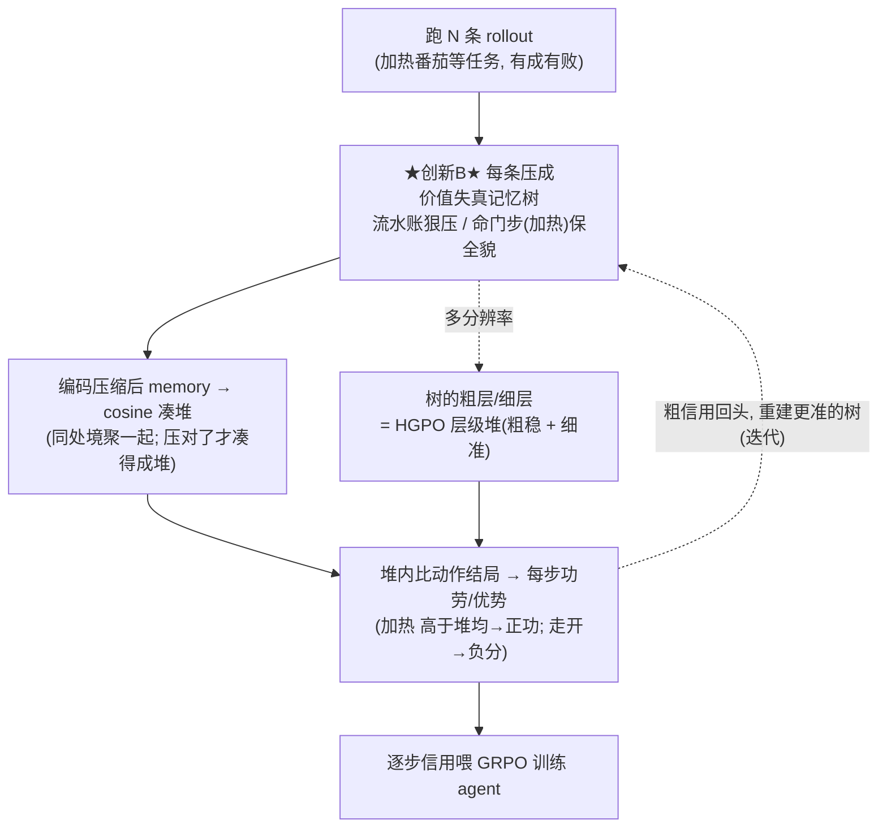

# Memory 压缩新范式 —— 候选方案 + 阅读清单

> **背景**:方向定了——"对压缩后 memory 做信用分配"可以做;但**创新点必须落在"压缩方法"本身,压缩得足够新颖**。
> **可用空档**:folder 30 的 24 篇压缩论文,目标清一色是"压完还能检索 / 答题 / 拿任务奖励";**没有一篇是为了"压完还能把信用分对"去压的**。压缩的**目标函数**这一格是空的——这是三个候选的共同立足点。
> **约束**:要与图/树相关(原始诉求);要能在 ALFWorld/WebShop 上落地;算力 1×12G(前期离线),后期 A100。

---

## 三个候选压缩原则

### A. 行为等价压缩(bisimulation 商图)

- **核心原则**:按"**行为是否等价**"合并历史,而非"内容像不像"。两段历史只要导向相同的未来动作分布/价值,就塌成图上同一个节点。压缩 = 对轨迹取 **bisimulation 商图**。
- **图/树结构**:节点 = 行为等价类;边 = 类间转移。整条轨迹被投影成这张商图上的一条短走法。
- **为什么算"新压缩"**:现有图记忆(PlugMem/MRAgent/Memora)按**语义**合并;这里按**动力学/行为**合并——压缩准则变了。
- **风险 🟠**:BiPACE 就是做 bisimulation 分组的。**容易被说成"这分组不就是 BiPACE 吗",不像新压缩方法。** 要压缩化、且和 BiPACE 的"分组"划清界限。

### B. 价值失真率失真记忆树(按决策关键度自适应分辨率)⭐ 推荐

- **核心原则**:一条轨迹里,流水账段狠压、生死岔路口保全貌。**决定"哪压狠、哪保细"的,是这一段细节对决策/信用的影响(价值失真),不是"最近"也不是"最像"。**
  - 一句话:*记忆的比特该花在"影响决策/信用"的地方——一个以"价值失真"而非"重构误差"为准的率失真(rate-distortion)记忆压缩。*
- **图/树结构**:一棵**多分辨率记忆树**——靠根粗(routine 段折叠成一句),靠叶细(关键决策点保全貌);像轨迹的 mipmap/小波,只在"价值失真高"处细化。
- **为什么算"新压缩"**:① 讲的是**比特怎么分配**,是地道的压缩方法,不会被说成"BiPACE 的分组";② "失真 = 价值/信用误差"这个目标,**24 篇里没有**;③ 正好打综述 §4 的老大难 **bifurcation point(关键动作稀少却决定性)**;④ 树原生,理论味足(率失真 / 信息瓶颈),导师这类 RL 背景吃这套。
- **风险 🟡**:需要先有个粗 CA 才知道哪儿"价值失真高" → 迭代循环(粗压→估信用→关键处细化→再估),要讲清这个循环;RGMem/Memora 做过多尺度/抽象-具体,**需读清差别**(它们为检索,你为信用)。

### C. 因果充分压缩(丢了会改决策才留)

- **核心原则**:问"**删掉这条记忆,agent 的动作/价值会不会变?会变才留**"。压缩 = 保留策略的最小充分统计量(counterfactual/causal sufficiency)。
- **图/树结构**:记忆项之间的**因果依赖图**——哪条记忆影响哪个决策。
- **为什么算"新压缩"**:压缩准则是**因果必要性**,不是相关性/相似度。
- **风险 🟠**:Mem-T / MemoPilot 的"用 RL 学 selective memory"离这个近。**要讲清:它们靠任务奖励学"留啥",你靠反事实因果度量"留啥",差在信号与可解释性。**

**推荐 B**:最像"新压缩方法"(导师要的正是压缩要新)、目标函数别人没有、树/图原生、接住 bifurcation point。A 易被说成 BiPACE,C 易被说成 Mem-T。

---

## 论文支持(供明天精读)

> 分两类:【本地】= 你 `Downloads/ICML 2026/` 文件夹里已有;【外部经典】= 请按标题检索确认版本(是真实且知名的文献)。

### 支撑 B(推荐方案,重点读)

**外部经典 —— 新原则的理论根**
- **Prioritized Experience Replay**(Schaul, Quan, Antonoglou, Silver, ICLR 2016)。⭐ **最重要的锚**:它已经在"**按 TD-error(=价值惊讶)决定记忆优先级**"——这正是 B 的种子。区别:PER 是"回放优先级",你是"压缩分辨率";原则同源,把它讲成"从优先级升级为压缩"。
- **The Information Bottleneck Method**(Tishby, Pereira, Bialek, 1999)+ **Deep Learning and the Information Bottleneck**(Tishby & Zaslavsky, 2015)。率失真 / 信息瓶颈的理论框架,B 的"用最少比特保住任务相关信息"就是它。
- **Value-Preserving / value-aware state abstraction**(David Abel 一系,如 "State Abstraction as Compression in Apprenticeship Learning","Value Preserving State-Action Abstractions",2019-2020)。"保住价值的抽象"= 你的"保住信用的压缩"最近的理论亲戚。
- **Information-theoretic bounded rationality**(Ortega & Braun 一系)。比特有限时如何最优决策,支撑"比特该花在影响决策处"。

**本地 —— 需读清"差别"的邻居**
- 【本地 30-工作8】**RGMem**(重整化群多尺度记忆)——多尺度粗粒化,但为个性化/检索。
- 【本地 30-工作23】**Memora**(抽象-具体平衡)——统一 RAG/KG,但为检索。读它俩确认"多分辨率"这个壳没被你要做的"价值失真"填过。
- 【本地 30-工作7】**Neuromem**——结论"记忆数据结构决定质量上界、激进压缩多是把成本在插入/检索间搬运",可当你论证"压缩目标选错"的引子。
- 【本地 29-工作5】**EMPG**——熵调制;提醒你"不确定性"要用**价值失真**而非**熵**,以区别它。

### 支撑 A(行为等价)

- 【本地】**BiPACE**(2606.25556)——你的正主,bisimulation 分组(actor 隐状态 cosine)。
- **外部经典**:**Bisimulation Metrics for MDPs**(Ferns, Panangaden, Precup, 2004);**Scalable state similarity**(Castro, AAAI 2020);**DBC: Learning Invariant Representations for RL without Reconstruction**(Zhang et al., ICLR 2021);**MICo**(Castro et al., NeurIPS 2021)。这四篇是"行为等价度量"的主干,A 要建在它们上。
- 【本地 29-工作3】**HPO**——意图空间语义聚合(行为等价的近亲,带方差界)。
- 【本地】**GEPO**(2510.26270)——软状态别名(Sentence-BERT cosine),已占"软合并建图"。

### 支撑 C(因果充分)

- 【本地 30-工作21】**Mem-T**、【本地 30-工作15】**MemoPilot**——学 selective memory(要划清界限)。
- 【本地 30-工作14】**TSGD**——记忆当有容量预算的可学参数,Add/Edit/Delete。
- **外部经典**:**Counterfactual Credit Assignment in Model-Free RL**(Mesnard et al., ICML 2021);**RUDDER: Return Decomposition for Delayed Rewards**(Arjona-Medina et al., NeurIPS 2019)。反事实/因果归因主干。

---

## 明天的阅读计划(优先级)

**第一梯队(定 B 的理论根,必读)**
- [ ] Prioritized Experience Replay(Schaul 2016)——B 的种子,读透"按 TD-error 分配"
- [ ] Information Bottleneck(Tishby 1999 / 2015)——率失真框架
- [ ] Abel 的 value-preserving abstraction——"保价值的压缩"

**第二梯队(划清与邻居的界限)**
- [ ] 本地 30-工作8 RGMem、30-工作23 Memora(多分辨率/抽象,但为检索)
- [ ] 本地 30-工作7 Neuromem(压缩目标选错的证据)

**第三梯队(若倾向 A/C 再看)**
- [ ] A:Ferns 2004 / DBC / MICo + 本地 BiPACE
- [ ] C:Mesnard 2021 / RUDDER + 本地 Mem-T

---

## 读完后待定的下一步(grilling 续)

1. **锁定 A/B/C**(我推荐 B)。
2. 若 B:把"价值失真记忆树"落成 ALFWorld 可跑的**具体结构**——节点=什么、边=什么、"价值失真"用什么量(TD-error?优势方差?)、粗压→细化的迭代怎么设。
3. **M1 闸门**仍在:verl-agent 抽真实 memory,先验证"压缩确实会损害分组/信用",瓶颈真存在再投入。

---

## B 的完整流程图(压缩 → 信用分配)

> 加粗/★创新★ 的是你唯一要创新的一块(压缩);其余是借用的容器(GiGPO/BiPACE/HGPO,导师已批准)。

**三句话总结**:
1. B 把"加热"这种命门步保清楚 → 下游凑得成干净的堆 → 信用分得对;
2. 别人压糊了(0.56)→ 堆乱 → 信用分错;
3. "粗信用回头重建树"那根虚线 = 迭代连环扣(收敛性是风险点)。

**新旧分工**:凑堆分信用(C/D/E/F)= 借来的容器,合法;怎么压(B)= 你的创新,且是让 C 凑得成堆的前提。

---

*已读定版:GraphGPO / G2PO / GEPO / BiPACE / HPO / BEACON / EMPG / ∆Belief-RL / Mem-T / MemoPilot(HGPO、GiGPO 已熟)。*
