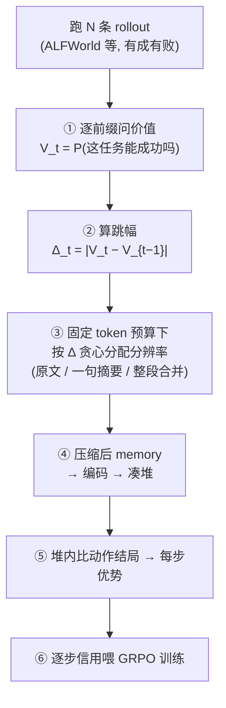

# Memory 压缩软分组信用分配 —— 价值失真记忆树

## 1. 问题定位与动机链条

### 1.1 场景

agentic RL，单智能体多轮交互，**稀疏轨迹奖励** → 需要把功劳/罪责摊到每一步（credit assignment, CA）。主流范式是**分组式 CA**：把"处于相同处境"的多次决策凑成组，组内比不同动作的回报 → 得到每步优势（GiGPO / HGPO / BiPACE / GraphGPO / G2PO / GEPO 一系）。

### 1.2 动机必须锚在 token，不能锚"记忆算法难" ⚠️

**Ni et al. 2023**（记忆与信用分配解耦）用 Passive/Active T-Maze 证明：**Transformer 靠大 context 就能解到 1500 步的记忆任务**。

→ **"记忆长 ⇒ 需要压缩"这条论证是假的。** 如果动机为写成"长程记忆很难，所以要压缩"，一句话就被 Ni 2023 打穿。

**正确的动机只有一条**：

> LLM agent 的 context 有**硬上限**（token 数）。长程任务的完整交互历史必然超限。所以压缩不是"为了让记忆算法更好学"，而是**物理上非压不可**。

**推论（决定了 §3 决定 5）**：既然动机是 token 硬上限，压缩就必须是**固定 token 预算**，不能是固定比例——固定比例下 token 仍随轨迹长度线性增长，照样超限，动机自毁。

### 1.3 空档在哪

已阅读24 篇 memory 压缩论文（ICML 2026 folder 30 等），目标清一色是"压完还能**检索** / **答题** / **拿任务奖励**"。

**没有一篇是为了"压完还能把信用分对"去压的。** 压缩的**目标函数**这一格是空的。

### 1.4 为什么值得做

**BiPACE 结论节原文**：

> *"extending the bisimulation-guided grouping to agents that **compress history into a memory module** (where direct observation hashing is intractable) is an interesting avenue for future work."*

**HGPO** 也承认：一旦历史被 memory 模块压缩，层级分组变得 intractable。

**Mem-T / MemoPilot**（都做"用 RL 学 selective memory"）：MemoPilot 自认 Limitation 2 —— 长程上下文的压缩**被外包给预处理，不是端到端学的**。

→ 这三家共同留下的空位。

---

## 2. 方法：价值失真记忆树

### 2.1 整体流程



**新旧分工**：④⑤⑥ 是**借来的容器**（GiGPO / BiPACE / HGPO）；①②③ 是**创新的一块**，且是让 ④ 凑得成堆的前提。

### 2.2 步骤①：价值信号

$$V_t = P\big(\text{任务最终能成功} \mid \text{前 } t \text{ 步的记忆}\big)$$

**怎么拿**：直接问 LLM —— *"当前记忆：{...}。问：这个任务最终能成功吗？只回答一个字：是 或 否。"* → 取 $P(\text{是})$。

**为什么用问模型而不是别的**（详见 §3 决定 2）：

| 候选 | 为什么不用 |
|---|---|
| 训价值网络（critic） | 主线全是 critic-free，引入 critic 与容器不兼容、多一个失败点，且"critic 准不准"只是把问题转移 |
| 蒙特卡洛真实回报 | **稀疏奖励下退化**：$R_t=\gamma^{T-t}R_{\text{final}}$ 单调，跳幅 $=\gamma^{T-t}(1-\gamma)R_{\text{final}}$ 纯粹是"离终点多远"的函数 → **直接撞 GraphGPO 的最短距离** |

**为什么问模型是可接受的**：压缩是**预处理**，不参与梯度、不进 loss，所以只需要**排序对**（能分出哪步跳得更大），不需要绝对精确。

**这条假设必须被验证**，见 §6 实验②。

### 2.3 步骤②：跳幅

$$\Delta_t = \big|V_t - V_{t-1}\big|,\qquad V_{-1} := 0.5\ (\text{先验})$$

$\Delta_t$ 大 = 这一步让"能不能成"的判断剧变 = **决策关键步**，该保细节；
$\Delta_t \approx 0$ = 流水账，该狠压。

**这个量的血统**：**PER**（Prioritized Experience Replay）已经在按 TD-error（= 价值惊讶）分配**回放优先级**；本方法把同一原则从"回放优先级"升级成"**压缩分辨率**"。同一句话"把资源砸在意外/重要处"，换了作用对象。

### 2.4 步骤③：三档分辨率 + 树 ★核心创新

**不是"留 / 删"两档开关，而是多档**：

| 跳幅 | 处理 | 树上位置 |
|---|---|---|
| 大 | **原文一字不差** | 叶子 |
| 中 | **压成一句摘要** | 中间层 |
| 小（连续低跳幅段） | **整段合并成一句** | 靠近根 |

**树是这么冒出来的**：把连续的低跳幅步捏成一个包，这个包就是树上的一个节点。

```
             整条轨迹（根：一句话）
            /        |          \
      [找番茄]     加热!        [放桌上]      ← 中间高跳幅 → 单独一片叶子
      / | \                     /  \            两边低跳幅 → 捏成包
     8步细节                   5步细节          ← 想看细节可以展开
```

**压缩 = 决定每个分支展开到第几层。** 关键处展到叶子，流水账停在中间层。

**为什么必须多档、不能两档**（详见 §3 决定 4）：两档 = "按重要性打分取 top-k"，这种做法太常见，达不到导师要的"压缩方法足够新颖"；而且名字叫"记忆树"、实际是平的筛选器，第一个问题就是"树呢"。

### 2.5 固定 token 预算的贪心分配

**给定预算 $B$**（如 512 token，与 MemoPilot 对齐）：

1. 按 $\Delta_t$ 从大到小排队；
2. 依次花预算把该步展开到最细（原文）；
3. 预算不够展原文时降档（摘要）；
4. 预算耗尽 → 剩余步全部捏成一句。

**这一步白送的东西**：预算固定 ⇒ 各档必须**互相竞争** ⇒ 压缩率可连续调节 ⇒ **这就是 IB 里 $\beta$ 旋钮的物理意义**（见 §4）。固定比例给不了这个，因为每条轨迹各留各的，互不相干。

---

## 3. 七条设计决定（定版）

| # | 问题 | 定案 | 排除了什么 / 为什么 |
|---|---|---|---|
| **1** | 尺子用**价值**还是**信念** | **价值**（能不能成） | 信念（对隐变量的后验）降格为"价值为什么变"的解释。理由：① 本方法目标是保住**信用**，信用=优势=价值差，同量纲才接得上理论；② "按信念变化压"已被 **∆Belief-RL** 占位；③ 信念变但价值不变的信息（"朋友养了猫"）不该保留 |
| **2** | 价值从哪来 | **问大模型**（主线）<br>组内分歧 → 讨论 + 可选 ablation | 排除 critic（与 critic-free 容器不兼容）；排除 MC 回报（稀疏奖励下退化成"离终点多远"→ **撞 GraphGPO**） |
| **3** | 跳幅 vs 压缩前后差 | **跳幅 = 压缩规则**<br>**压缩前后差 = 评估指标** | "压掉后判断会不会变"正是**另一条候选路线「因果充分压缩」的定义**（删掉这条记忆、决策会不会变？会变才留），当规则会让本方法塌成它；且每试一种压法要重问一遍模型，贵得离谱。但它是 IB 里"失真"的正统定义，留作评价体系 |
| **4** | 两档还是多档 | **三档起步**，真把树建出来 | 两档 = top-k 筛选，新颖性不够（导师那句话要卡的正是这里）；且方案叫"记忆树"却是平的筛选器 |
| **5** | 固定比例还是固定预算 | **固定 token 预算** | 固定比例下 token 仍随 $L$ 线性增长 → 照样超限 → **动机自毁**；且实验图上 vtree 会变成斜线，说服力大减 |
| **6** | 怎么证明 | **必须直接测信用分配精度** | sep-AUC（能否认出同处境）是信用分配的**上游**，任务成功率是**下游**，中间那环从没量过。"你说为信用而压，那你证明信用变准了吗" |
| **7** | 迭代循环做不做 | **不做**，A 一遍过 | 循环（粗压→分组→看分歧→重压）只在用组内分歧时才需要；加了循环 = 主故事从一句话变成一段话，且收敛性说不清 = 硬伤 |

---

## 4. 数学骨架：信息瓶颈（IB）

$$\min_{p(t\mid x)}\ \ I(X;T) - \beta\, I(T;Y)$$

**本方法是 IB 的一个实例化**：

| IB | 本方法 |
|---|---|
| 输入 $X$ | 完整交互历史 |
| 压缩表示 $T$ | 压缩后的 memory |
| 任务目标 $Y$ | **信用 / 价值** ← **换掉的就是这一格** |
| $I(X;T)$（要 min） | memory 占多少 token |
| $I(T;Y)$（要 max） | memory 对信用分配还剩多少判断力 |
| $\beta$ | **token 预算旋钮**（§2.5） |

$$\min_{\text{压缩规则}}\ \underbrace{I(\text{历史};\text{memory})}_{\text{token 成本}} - \beta\ \underbrace{I(\text{memory};\text{信用})}_{\text{信用判断力}}$$

**立足点要讲清**：本方法不是发明 IB（1999 年的成熟框架），新的是这三点：
1. 把 IB 的 $Y$ **换成信用/价值** —— CA 主线五篇都没用过 IB；
2. 用 **PER 的价值跳幅**把 IB 抽象的 $D_{\text{KL}}$ 失真落地成可逐步算的量；
3. **理论亲戚**：Abel 的保价值抽象证明"合并价值相近的状态，价值损失有界" → 可改写成"**压缩到什么程度，信用误差有界**"，这是本方法潜在的理论卖点。

---

## 5. 与邻居的界限（逐个划清）

| 论文 | 它做什么 | **和本方法的分界线** |
|---|---|---|
| **BiPACE** | 隐状态 cosine 软聚类分组 + 动作反事实 | ① 它是**横向**合并状态空间，本方法是**纵向**变时间轴粒度；② 它挂 bisimulation 的名、干 **朴素 cosine** 的事（不查奖励/转移/递归/无理论保证），本方法用价值跳幅比它更接近"保价值合并"；③ **它自己把这个方向写成 future work** |
| **HGPO** | 层级分组（历史步数分层） | 承认 memory 压缩后层级分组 intractable；本方法的树的粗/细层正好可以当它的层级 |
| **GraphGPO** | 状态转移图 + 反向 Dijkstra 距离 | **最危险的碰撞**：若本方法用 MC 回报当价值，跳幅退化成"离终点多远"= GraphGPO。**这是 §3 决定 2 排除 MC 的直接原因** |
| **G2PO / GEPO** | 图上做信用分配（边 TD / 介数中心性×语义） | 都在**单局内做信用分配**，不碰压缩；且 G2PO 用 truncate 处理长序列 → 本方法的 T-maze 实验正是打它这个地基 |
| **∆Belief-RL** | 按**信念变化**做信号 | **§3 决定 1 就是为躲它**：本方法锚价值不锚信念，且把信念收编为"价值变化的原因" |
| **MemoPilot** | 训记忆模型写 selective memory，多轮 GRPO | ① **轮级**（一局一份笔记）vs 本方法**步级**；② 自认 Limitation 2：长程压缩靠预处理、非端到端 → **本方法就是它这条 limitation 的答案**；③ 它的"Full History 反而更差"是本方法动机的现成实验证据 |
| **Mem-T** | MoT 树把终局分稠密化 + hindsight 回传到记忆操作 | 信号是 **QA 的 F1 / 证据密度（文本重合）** → 压缩改变文本后信号就失灵，所以它把压缩推给预处理。本方法用**不依赖文本表面**的价值跳幅，压缩才可学 |
| **HIPIF** | 分层规划 + 子目标完成后折叠历史 | **事件驱动**（子目标做完就折叠）vs 本方法**信用驱动**；**子目标级整块折叠** vs 本方法**步级连续粒度**。子目标内部关键步和平坦步混着，一刀切会连关键步一起折 |
| **RGMem / Memora** | 多尺度粗粒化 / 抽象-具体平衡 | 壳一样（多分辨率），**目标不同**：它们为检索/个性化，本方法为信用 |
| **PER** | 按 TD-error 分配回放优先级 | **本方法的种子**，不是竞品：同一原则从"复习谁"换成"压谁" |
| **Ferns / DBC / MICo** | bisimulation 度量（行为等价） | **方法论模板，不是公式套用**：借它们"距离由任务定义、从采样中学、省算力但保上界"这套做法；本方法的距离是价值跳幅，不是 $\mid R\mid+\gamma W_1$ |
| **RUDDER / CCA** | 回报分解 / 反事实信用 | RUDDER 的"哪步让预测突变"= 跳幅的另一种算法（LSTM 而非问模型），可当备选量法；CCA 是「因果充分压缩」那条路线的主干 |

---

## 6. 实验设计（四项，按优先级）

### ① `tmaze_text_test.py` —— 动机图【已改完，待跑】

**证三条**：① truncate 会崩（trunc-$k$ 在 $L>k$ 断崖到 0.5）② 压缩不崩（vtree ~1.0）③ **压缩省 token（vtree 平线 vs full 线性爆炸）**。

第③条是动机命门（§1.2），原版缺失，已补。同时补：$N$ 20→100、3 seeds 误差棒、**去掉"第 0 步无条件保留"的作弊**（线索恰在第 0 步，硬留等于送答案）、新增 `vtree_val`（价值信号，主臂）与 `vtree_bel`（信念信号，对照）。

**已有结果（旧版，$N=20$ 单 seed，无 token）**：

| L | no_mem | full | vtree | trunc2 | trunc8 |
|---|---|---|---|---|---|
| 1 | 0.60 | 1.00 | 1.00 | 1.00 | 1.00 |
| 2 | 0.55 | 1.00 | 1.00 | **0.55** | 1.00 |
| 4 | 0.50 | 1.00 | 1.00 | 0.50 | 1.00 |
| 8 | 0.40 | 1.00 | 1.00 | 0.40 | **0.40** |
| 16 | 0.45 | 1.00 | 1.00 | 0.45 | 0.45 |

断崖精确落在 $L>k$。

### ② 信号可信度检验 —— 保地基【待建】

**回答**："你那个'能不能成'是问大模型问出来的，凭什么准？"

做法：跑 100 条真实轨迹 → 记下**真实成败** → 在第 $t$ 步问模型 $P(\text{success})$ → 算预测与真实的相关性（AUC）。

| 结果 | 结论 |
|---|---|
| AUC > 0.8 | 假设成立，主线站得住 → 写进论文当验证图 |
| AUC 低 | 信号不可信 → 必须上组内分歧，主线要改 |

**很便宜**（复用已有 `value_of`），但把"我假设模型准"变成"我验证了模型准"。

### ③ `credit_rank_test.py` —— 本方法的核心证据【待建，最大的洞】

**现在两个实验测的都不是信用分配**：sep-AUC 是上游（能否认出同处境），任务成功率是下游。**中间那环从没量过。**

做法：造标准答案已知的任务（Passive T-maze 关键步 = 第 0 步；Key-to-Door = 拿钥匙那步），用 full / naive / trunc-$k$ / vtree 四种记忆分别跑信用分配，**量关键步的功劳排第几名**。

| 记忆 | 期望结果 |
|---|---|
| full | 第 1 名（上界） |
| naive | 乱排（压糊 → 功劳分错） |
| trunc-$k$ | 关键步根本不在记忆里 |
| **vtree** | **第 1 名 ← 本方法的主张** |

### ④ `value_tree_test.py` 升级【待做，工作量最大】

`KEEP_RATIO=0.4` → **固定 token 预算**；两档 → **三档**；把**树真的建出来**。

排最后是因为改完要用 ③ 的评估框架验证是否真的更好。

**已有结果（旧版，两档 + 固定比例，3 seeds）**：

| 臂 | sep-AUC |
|---|---|
| raw（全历史，上界参照） | 0.939 |
| naive（笨摘要，下界） | 0.499 |
| **vtree（本方法）** | **0.969** |

**vtree > raw** 是个值得写进论文的观察：全历史里的 filler 不只浪费 token，还**干扰**处境判断；压掉后信号更纯。这和 MemoPilot 的"Full History 反而更差"是同一现象，但在这里被定量化了。

---

## 7. 待办清单

| | 事项 | 状态 |
|---|---|---|
| ① | tmaze 加 token 计数 / 多 seed / 价值信号 / 去作弊 | ✅ 已改（commit `516d22d`），**待在服务器跑** |
| ② | 信号可信度检验 | ⬜ 待建 |
| ③ | `credit_rank_test.py` 直接测信用精度 | ⬜ 待建 |
| ④ | `value_tree_test.py` 升级三档 + 固定预算 + 建树 | ⬜ 待做 |
| M1 | verl-agent 抽**真实** memory，把合成换掉 | ⬜ 钩子已写在 `value_tree_test.py` 末尾 |
| — | Active T-Maze（多候选关键步，本方法的真本事图） | ⬜ 钩子已写在 `tmaze_text_test.py` 末尾 |

---

## 8. 风险与缓解

| # | 风险 | 触发信号 | 应对 |
|---|---|---|---|
| ① | **价值信号不可信** | 实验②的 AUC 低 | 这是地基，所以实验②排在前面、早验证便宜地 fail；退路是上组内分歧（真回报驱动） |
| ② | **三档的中间档做不出来** | 摘要质量差、或摘要成本太高 | 先用规则模板（保留动作词+对象词）当摘要，不调模型；调模型做摘要留作升级 |
| ③ | **Passive T-maze 太送分** | 关键步唯一且明显，选不错 | 已知问题，脚本注释里写明。**必须做 Active / 多线索版**才算证了本方法的真本事 |
| ④ | **合成数据不可信** | 旧诊断已踩 7 个测量假象（池化方式、prompt 包裹、短文本表示坍缩……每个都能把结论翻面） | 合成只作机制原型、**不进论文当证据**；论文证据来自 M1 真 memory |
| ⑤ | 算力 / RL 不稳 | 开放环境 RL 昂贵、易不稳 | 分级：先 1.5B、先短程环境；主实验做不完退守"诊断 + 基准 + 轻方法" |

---

## 9. 保留：旧方向仍然有效的部分

### 9.1 verl-agent 工程定位（M0 已完成）

- **默认 `SimpleMemory` 根本不压缩** —— 只取最近 K 步原始拼接。其 `memory/README.md` 明说这只是"最简单的起点"，把 dynamic summarization 列为鼓励扩展的方向。
  → **连主流 agentic-RL 框架都不默认压缩**，"必须压缩"确实需要论证（§1.2 已论证）。
- memory 在哪进 LLM：`env_manager.build_text_obs`
- 真值状态标签用 `anchor`（去掉历史的当前观测；两步 anchor 相同 = 同一底层状态）

### 9.2 M1：抽真实 memory 表示

ALFWorld / WebShop 跑少量 rollout（仅推理、4bit、3060 可跑），逐步 dump `(memory 表示, anchor 真值状态, 动作, 回报)` 到 `mem_records.jsonl`。
→ `value_tree_test.py` 末尾已写好钩子，主流程一字不改。

### 9.3 训练环境与算力路线

- **必须（与 baseline 对齐）**：ALFWorld、WebShop（GiGPO/HGPO/BiPACE 都报），TextCraft（BiPACE 用）—— verl-agent 已集成
- **最贴"观测唯一 + 长历史"**：WebShop / WebArena
- **轻量跑通 pipeline**：MiniWoB++ / BabyAI
- **算力**：4×A100 先训 Qwen2.5-1.5B（对齐 HGPO 设置、最省），跑通再上 7B

### 9.4 一个必须记住的教训

旧诊断阶段先后踩了 **7 个测量假象**（池化方式、prompt 包裹、处境难度、奖励泄漏、短文本表示坍缩、理想 vs 真实压缩、摘要器质量），**每一个都能把结论翻面**。

→ **合成实验只作机制原型和方向勘探，不作论文证据。** 这条对本方法同样适用。

---

*已读定版：GiGPO / HGPO / GraphGPO / G2PO / GEPO / BiPACE / HPO / BEACON / EMPG / ∆Belief-RL / Mem-T / MemoPilot / HIPIF；外部经典 PER / IB / Abel / Ferns / DBC / MICo / RUDDER / CCA / Ni 2023。详解均在 `~/Downloads/压缩CA_核心论文/`。*
