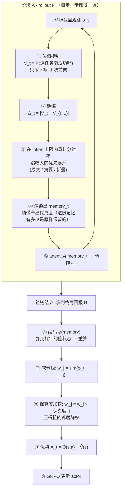

# Memory 压缩软分组信用分配 —— 价值失真记忆树

> **一页看完**：agentic RL 里，agent 的交互历史会撑爆 LLM 的 context，必须压缩。
> 现有压缩方法都是"压完还能**检索/答题**"，**没有一个是为了"压完还能把功劳分对"**去压的。
> 本方法按"**这一步让'能不能成'跳了多少**"来分配有限的 token —— 关键步留原文、流水账折叠成一句。

---

## 0. 全文导读

### 0.1 这份文档在讲什么

| 章节 | 回答的问题 | 状态 |
|---|---|---|
| **§1 动机** | **为什么**要压缩？为什么现有方法不够？ | 论证 + 他人工作佐证 |
| **§2 方法** | 具体**怎么压**？ | ✅ 已被实验 ①③④ 验证 |
| **§3 压完怎么算信用** | 压缩改变了什么，CA 侧要跟着改什么？ | ⬜ **设计，未验证**（实验⑤ 待建） |
| **§4 理论骨架** | 这套做法在数学上对应什么？ | 借用信息瓶颈（IB） |
| **§5 与邻居的界限** | 和已读的 12 篇工作差在哪？ | 逐个划清 |
| **§6 实验** | **证据到哪一步了？** | ①③④ 已跑完，②⑤★ 待办 |
| §7–§9 | 待办 / 风险 / 工程落地 | — |

### 0.2 方法是两块，不是一块

**整个方案 = 压缩（怎么记） + 信用分配（怎么算功劳）**，两块咬合在一起：

```
┌─── 第一块：压缩 ────────────────────────────┐
│  每走一步:                                   │
│   ① 问模型"这任务能成功吗" → 把握值 V_t       │
│   ② 看它跳了多少 Δ_t —— 跳得大 = 转折点       │
│   ③ 在固定 token 上限内按跳幅分配详细程度:     │
│        原文 / 一句摘要 / 整段折叠             │
└──────────────────────────────────────────────┘
                    │
        memory_t ───┤    ★顺带产出: 每步被压得多粗(保真度)
                    │
┌─── 第二块：信用分配 ────────────────────────┐
│  轨迹跑完后:                                 │
│   ④ 把"处境相似"的步凑成一堆(软分组)          │
│   ⑤ 堆里按"做了什么动作"分开比 → 每步的功劳   │
│   ⑥ 压得粗的记忆【打个折】←用上面那个保真度   │
└──────────────────────────────────────────────┘
```

#### 第一块：怎么压（①②③）

1. **每走一步，问模型一句**"这任务能成功吗" → 得到把握值 $V_t$；
2. **看它跳了多少**（$\Delta_t$）—— 跳得大 = 这一步是转折点；
3. **在固定 token 上限内**，按跳幅从大到小分配详细程度：**原文 / 一句摘要 / 整段折叠**。

压完一条轨迹长这样：

```
你在厨房里四处找番茄               ← 原文（跳幅大）
(此处 3 步例行操作已折叠)          ← 折叠（跳幅≈0）
打开微波炉，把生的番茄放了进去      ← 原文（跳幅最大 = 命门）
(此处 2 步例行操作已折叠)
把热的番茄放到桌上，任务完成        ← 原文（当前步必留）
```

#### 第二块：压完怎么算功劳（④⑤⑥）

一条轨迹跑完只有一个总分（成功=1 / 失败=0），要把它**摊到每一步**上：

4. **凑堆**：把"处境相似"的步凑到一起 —— 相似程度用压缩后 memory 的向量距离衡量（**不做一刀切，按像的程度给权重**）；
5. **堆内按动作比**：同一个处境下，做了动作 A 的平均结果 vs 全堆平均 → 差值就是这一步这个动作的**功劳**；
6. **给压得粗的记忆打折**：它可能已经丢了要紧的东西，别太当真。

#### 两块是【咬合】的，不是先后两段

**压缩过程顺带就知道"每一步被压得多粗"**（原文 / 摘要 / 折叠），这个信息直接喂给第 ⑥ 步去调权重 —— **不用额外计算**。

> **这是"压缩 + 信用分配一起做"相比"只压"或"只分"多出来的东西**：不做压缩的方法，根本不知道哪条记忆更可信。

⚠️ **但第二块整块还没验证**（详见 §3 与实验⑤）。已跑完的三个实验测的都是第一块。

### 0.3 目前的结论（截至最新一轮实验）

| 主张 | 状态 | 证据 |
|---|---|---|
| **truncate（按位置截断）会崩** | ✅ **确立** | ① trunc-k 在 L>k 断崖到瞎猜；④ 中它的 sep-AUC 掉到 0.512≈随机 |
| **压缩省 token** | ✅ **确立** | ① L=16 时 40 tk vs full 301 tk，**省 7.5×**，且不随轨迹变长而涨 |
| **压缩不损害处境识别** | ✅ **确立** | ③ vtree 0.997 vs full 0.998 |
| **动机一：压了不亏** | ✅ **兑现** | ④ L=14 时信用集中度追到 full 的 **99%** |
| **动机二：压了更好** | ⚠️ **未兑现** | ④ 只看到趋势迹象（92%→99%），需更长轨迹定论 |
| §3 的 CA 四条改法各自值不值 | ⬜ **完全未验证** | 实验⑤ 还没建 |

**一句话**：**"必须压"已经证实，"压了更好"还没有。**

### 0.4 顺带记下的教训（读之前知道更好）

这份文档保留了几处**被实测推翻的猜测**，没有删掉：

- 探针成本估成 1~3%，实测 48%（长记忆下 prefill 才是主成本）；
- 以为折叠标记是噪声，实测**去掉反而更差**（它携带时序信息）；
- 以为自适应压缩损害表示一致性，实测 trunc-4 一致性最低却表现更好；
- 判读标准只盯 sep-AUC，漏掉真正的判据是"**相似度差距**"。

**留着是因为它们都指向同一个毛病：单一视角推到底、不找反例。** 后面凡是"因为 A 所以 B 所以 C"的链条式论证，都该先问一句"有没有反过来的情况"。

---

## 1. 问题定位与动机链条

> **本节回答**：为什么非压不可？为什么现有的压缩方法不够用？

### 1.1 场景

agentic RL，单智能体多轮交互，**稀疏轨迹奖励** → 需要把功劳/罪责摊到每一步（credit assignment, CA）。主流范式是**分组式 CA**：把"处于相同处境"的多次决策凑成组，组内比不同动作的回报 → 得到每步优势（GiGPO / HGPO / BiPACE / GraphGPO / G2PO / GEPO 一系）。

### 1.2 两条动机：省 token（必需）+ 提纯信号（有益）

#### 动机一 · token 硬上限 —— 压缩是**必需的**

> LLM agent 的 context 有**硬上限**（token 数）。长程任务的完整交互历史必然超限。压缩不是"为了让记忆算法更好学"，而是**物理上非压不可**。

**推论**：既然是 token 硬上限，压缩就必须是**固定 token 上限**，不能是固定比例——固定比例下 token 仍随轨迹长度线性增长，照样超限。

#### 动机二 · 冗余会**主动干扰**信用分配 —— 压缩是**有益的** ★论文卖点

这条比第一条强：全历史里的无关内容不只占地方，还会**淹没**"这一步重不重要"的信号。

**目前的支持证据（都是间接的）**：

| 来源 | 发现 | 性质 |
|---|---|---|
| 本课题的合成诊断 | 原始不压 sep-AUC **0.52~0.67** → 忠实压缩 **0.93** | 合成数据，只作方向勘探 |
| MemoPilot Table 1 | Full History 的成绩**低于** selective memory，作者据此论证"需要 selective memory" | 他人工作，且是任务成功率（下游） |

⚠️ **两条都不是"信用分配"本身的证据** —— 一条是上游指标（能否认出同处境），一条是下游指标（任务成功率）。

**动机一说"不得不压"，动机二说"压了更好"。后者才是论文真正的主张，而它到现在【一条直接证据都没有】** —— 这正是 §6 实验④ 要补的洞。

#### ⚠️ Ni 2023 的边界在哪（这条要讲准，否则会被反问倒）

**Ni et al. 2023**（记忆与信用分配解耦）用 Passive/Active T-Maze 证明：Transformer 靠大 context 就能解到 1500 步的记忆任务。

它打掉的是这条论证：~~"长程记忆很难学 ⇒ 所以要压缩"~~ —— 记忆算法本身不是瓶颈。

**但它打不掉动机二**：Ni 证的是"**记得住**"，不是"**全记着对下游最好**"。

> **记得住 ≠ 分得对信用**

Transformer 能把 1500 步前的线索**取回来**，不等于在一堆流水账里还能**判准哪一步立了功**。上表三条证据说的正是后者。

### 1.3 空档在哪

已阅读24 篇 memory 压缩论文（ICML 2026 folder 30 等），目标清一色是"压完还能**检索** / **答题** / **拿任务奖励**"。

**没有一篇是为了"压完还能把信用分对"去压的。** 压缩的**目标函数**这一格是空的。

### 1.4 为什么值得做

**BiPACE 结论节原文**：

> *"extending the bisimulation-guided grouping to agents that **compress history into a memory module** (where direct observation hashing is intractable) is an interesting avenue for future work."*

**HGPO** 也承认：一旦历史被 memory 模块压缩，层级分组变得 intractable。

**Mem-T / MemoPilot**（都做"用 RL 学 selective memory"）：MemoPilot 自认 Limitation 2 —— 长程上下文的压缩**被外包给预处理，不是端到端学的**。

→ 这三家共同留下的空位。

---

## 2. 方法：价值失真记忆树

> **本节回答**：具体怎么压。
> **验证状态**：✅ 已被实验 ①③④ 验证（省 token、不损害处境识别、信用不亏）。

> 💻 **实现见 [`落地实现方案.md`](落地实现方案.md)**（架构 / 模块接口 / 接进 verl-agent 的挂载点 / 三阶段路线），核心模块已落地为 [`vtree_compressor.py`](vtree_compressor.py)。

### 2.1 整体流程

分两个阶段。**关键：压缩发生在 rollout *内部*，不是跑完再压**——因为 agent 决策时看到的就必须是压缩后的 memory，否则它照样超 context（见 `落地实现方案.md` §0）。



**每个环节的开销**（详见 `落地实现方案.md` §2）：

| 环节 | 何时 | 要不要"生成文字" | 开销 |
|---|---|---|---|
| ① 探针 | 每步 | ❌ 只读，答一个字 | 小；复用 agent 的 KV cache 后趋近 0 |
| ② 跳幅 | 每步 | ❌ 一次减法 | 0 |
| ③ 重排分辨率 | 每步 | ❌ 排序 + 贪心 | 0（纯 CPU） |
| ④ 渲染 | 每步 | 折叠/截断 ❌；LLM 摘要 ✅ | 默认 0；LLM 版可异步 |
| ⑥ 编码 | 轨迹后 | ❌ | 0（复用①的隐状态） |
| ⑦⑧⑨ 分组与优势 | 轨迹后 | ❌ 矩阵运算 | 0 |

**新旧分工**：⑥–⑩ 是**借来的容器**（GiGPO / BiPACE / HGPO）；**①–④ 是创新的一块**，且是让 ⑦ 凑得成堆的前提。⑦⑧⑨ 具体怎么改见 §3。

**注意 ④ 那个"顺带产出"**：**保真度**不是额外算的，是压缩过程本身就知道的（每步落在哪一档）。它一路带到 ⑧ 去给邻居降权——**这就是压缩和信用分配咬合的地方**（§3.3）。

### 2.2 步骤①：价值信号

#### 先定尺子：用「价值」不用「信念」

压缩的判据可以是两种量，必须先选定：

| | 是什么 | 例子 |
|---|---|---|
| **信念** | 对隐藏事实的猜测 | "宝藏在上侧"——知道了一件新事 |
| **价值** ⭐ | 对**能否成功**的预期 | "这任务有七成把握" |

两者常同步变，但会分家：**"前方塌方封路"**——信念没变（目的地还在原处），价值暴跌；**"朋友养了只猫"**——信念变了（多知道一件事），价值毫无变化。

**选价值，三条理由**：

1. **同量纲**：本方法要保住的是**信用**，而信用 = 优势 = 价值之差。判据和目标同量纲，才接得上理论（§4 的 IB 框架、Abel 的价值损失界）；
2. **避开占位**："按信念变化压"已被 **∆Belief-RL** 占了；
3. **该压的能压掉**："养了猫"这类信念变、价值不变的信息**不该保留**——用信念当judge就会把它留下。

**信念不是竞品，是价值变化的原因**：读到线索 → 信念变 → **所以**价值变。论文里可以把 ∆Belief-RL 收编成一个特例，而不是对手。

$$V_t = P\big(\text{success} \mid m_t\big)$$

其中 $m_t$ = 前 $t$ 步的记忆，$V_t$ = 模型认为任务最终能成功的概率。

#### $V_t$ 具体怎么算出来的

**一句话：不让模型把答案写出来，只看它"心里更想写'是'还是'否'"、倾向有多强。**

**① 拼一道填空题**

```
任务：加热番茄
当前记忆：
  你在厨房里四处找番茄
  找到并拿起生番茄
  手拿生的番茄，走到微波炉前

问：这个任务最终能成功吗？只回答一个字：是 或 否。
答：___
```

**② 模型读一遍，在真正落笔前，它对"这个空填什么"已经有一张倾向表**

| 候选字 | 倾向 |
|---|---|
| **是** | 0.28 |
| **否** | 0.12 |
| 这 | 0.15 |
| 应 | 0.09 |
| …（其余数万字） | … |

**③ 只取"是 / 否"两行，归一化**

$$V_t=\frac{p_{+}}{p_{+}+p_{-}}=\frac{0.28}{0.28+0.12}=0.70$$

（$p_{+}$、$p_{-}$ 分别是模型倾向填「是」「否」的分数。）

```python
lg = model(**enc).logits[:, -1, :]            # -1 = 最后一个位置 = 那个空
V  = softmax(lg[:, [yes_id, no_id]])[:, 0]    # 只在"是/否"之间比
```

#### 三个设计考虑

| 做法 | 为什么 |
|---|---|
| **只取"是/否"的相对值**，不用绝对概率 | 模型可能想说"这个""应该""不一定"，绝对概率被这些分掉。只在两者间比 = "被迫二选一时它偏哪边"，排除干扰 |
| **不让它真写出来** | 写 = 逐字生成，慢；读完取倾向表 = **一次前向**，快一个量级。这是探针便宜的根本原因 |
| **拿到的是连续值**，不是硬的是/否 | $V=0.70$ 比 $V=0.51$ 信心更强。**跳幅正是靠这个连续性才算得出来**——若只有离散的是/否，$\Delta_t$ 就只剩 0 和 1，全废 |

#### ⚠️ 它测的不是真实概率

$V_t$ 是**模型的主观判断**，很可能系统性偏乐观（LLM 普遍倾向答"是"）——实际成功率 50% 的处境它可能给 0.7。

**但这不影响方法**：我们只用**跳幅**（相对变化），不用绝对值。只要能分出"这步比那步跳得多"，排序对了就够。

**"排序对不对"本身是假设** → 实验②专门验它（见 §6）。

---

**为什么用问模型而不是别的**：

| 候选 | 为什么不用 |
|---|---|
| 训价值网络（critic） | 主线全是 critic-free，引入 critic 与容器不兼容、多一个失败点，且"critic 准不准"只是把问题转移 |
| 蒙特卡洛真实回报 | **稀疏奖励下退化**：回报-to-go 随步数单调（见 §2.3 下方块级公式），跳幅只剩"离终点多远"的函数 → **直接撞 GraphGPO 的最短距离** |

**为什么问模型是可接受的**：压缩是**预处理**，不参与梯度、不进 loss，所以只需要**排序对**（能分出哪步跳得更大），不需要绝对精确。

**这条假设必须被验证**，见 §6 实验②。

#### 顺带定死一件事：不做迭代循环

"组内分歧"那条备选信号会引出一个循环——**要知道组内有没有分歧，得先能认出同一处境；而认处境靠的是 memory，memory 又正是要压的东西**。于是变成：粗压 → 分组 → 看分歧 → 重压 → 再分组……

**不做。** 两条理由：

- **主故事必须一句话讲得清**："按价值跳幅分配 token" vs "先粗压、再分组、看分歧、重定跳幅、再压、再分组……"——后者听的人已经晕了；
- **收敛性说不清就是硬伤**：审稿人必问"这个循环收敛吗、会不会震荡"，要答上来是另一篇论文的工作量。

**问大模型这条路一遍过、无循环**，这也是选它当主线的隐含理由之一。组内分歧留作讨论与可选消融。

### 2.3 步骤②：跳幅

$$\Delta_t = \big|V_t - V_{t-1}\big|,\qquad V_{-1} := 0.5$$

（$V_{-1}=0.5$ 是先验：还没看任何观测时，成败五五开。）

$\Delta_t$ 大 = 这一步让"能不能成"的判断剧变 = **决策关键步**，该保细节；
$\Delta_t \approx 0$ = 流水账，该狠压。

**这个量的血统**：**PER**（Prioritized Experience Replay）已经在按 TD-error（= 价值惊讶）分配**回放优先级**；本方法把同一原则从"回放优先级"升级成"**压缩分辨率**"。同一句话"把资源砸在意外/重要处"，换了作用对象。

#### 为什么用「跳幅」当规则，而不用「压掉后判断变不变」

还有一个看起来更直接的判据：**把这段压掉，再问一遍模型——判断变了就说明它重要**。但它只能当**评估指标**，不能当压缩规则：

| | 用途 | 为什么 |
|---|---|---|
| **跳幅**（读书时划重点） | ✅ **压缩规则** | 边读边判断，**一遍过** |
| 压掉后判断变不变（划完盖住考自己） | ✅ 评估指标<br>❌ 压缩规则 | ① 它正是**另一条候选路线「因果充分压缩」的定义**（删掉这条记忆、决策会不会变？会变才留）——当规则会让本方法**塌成它**；② 每试一种压法都要重问一遍模型，**贵得离谱** |

但它不该丢掉——**它是 IB 里"失真"的正统定义**，正好拿来当评价体系：*我的压缩让价值判断偏了多少*。

**一句话**：跳幅是划重点的笔，"压掉后判断变不变"是检验划得对不对的考试。用笔的时候不考试，考试只在最后验收。

### 2.4 步骤③：三档分辨率 + 树 ★核心创新

**不是"留 / 删"两档开关，而是多档**：

| 跳幅 | 处理 | 树上位置 |
|---|---|---|
| 大 | **原文一字不差** | 叶子 |
| 中 | **压成一句摘要** | 中间层 |
| 小（连续低跳幅段） | **整段合并成一句** | 靠近根 |

**树是这么冒出来的**：把连续的低跳幅步捏成一个包，这个包就是树上的一个节点。

```
             整条轨迹（根：一句话）
            /        |          \
      [找番茄]     加热!        [放桌上]      ← 中间高跳幅 → 单独一片叶子
      / | \                     /  \            两边低跳幅 → 捏成包
     8步细节                   5步细节          ← 想看细节可以展开
```

**压缩 = 决定每个分支展开到第几层。** 关键处展到叶子，流水账停在中间层。

**为什么要中间档 —— 三条技术理由**（不是"为了新"）：

**① token 利用率：两档是 0-1 背包，零头用不掉**

两档下每步要么全占 token 上限、要么完全不占。当剩余 token 装不下某步的原文时，这步只能整条丢，剩的零头浪费。中间档能用这点零头保住主干。

**实测**（`vtree_compressor.py` 自测场景 4）。测试轨迹共 10 步，其中三条是**有用线索**、其余是无关的走廊描述（跳幅为 0）：

| 线索 | 内容 | 跳幅 $\Delta$ | 原文 | 摘要后 |
|---|---|---|---|---|
| **A** | 【线索A】钥匙藏在**红色**柜子里 | **0.40**（最重要） | 22 字 | 9 字 |
| **B** | 【线索B】**红色**柜子放在**二楼** | 0.25 | 20 字 | 9 字 |
| **C** | 【线索C】地上有张纸条，字迹模糊 | 0.07（最不重要） | 21 字 | 9 字 |

"保住 A B C" = 压缩后这几条线索仍在 memory 里（原文或摘要形式）。

| token 上限 | 三档保住 | 两档保住 | |
|---|---|---|---|
| 200 / 140 | A B C | A B C | token 充足，三条原文都装得下 → 两者相同 |
| **110** | **A B C** | A B | **三档多一条**：C 的原文（21 字）塞不下，但摘要（9 字）塞得下；两档没有降级选项，只能整条丢 |
| 90 | A B | A B | 相同 |
| **70** | **A B** | A | **三档多一条**：同理，B 降级为摘要保住了 |
| 50 | A | A | token 极紧，连 A 都勉强 → 两者相同 |

**② 失真应当渐变，不该是阶跃**

价值跳幅 $\Delta_t$ 是**连续量**。两档等于把它强行二值化，卡在阈值附近的步被迫"要么全保要么全丢"。率失真理论的基本精神是"**用多少比特传**"，不是"传或不传"——中间档让中等重要的步得到中等分辨率。

**③ 保真度需要分辨率 —— 这是 §3.2② 的前提条件**

两档下，被删的步**根本不在 memory 里**，不参与分组，保真度退化成"在 / 不在"，保真度加权无从谈起。

**只有三档才存在"在、但不可靠"这个状态**（摘要档，保真度 $=0.6$）——而 §3.2② 那条"压得粗的邻居降权"正是靠它。**中间档不是装饰，是 CA 侧那条创新的必要条件。**

**代价与边界（诚实说）**：

- 多一个摘要器组件，多一个失败点；
- **摘要改写错比直接删更隐蔽**——删掉了你知道它没了，改错了你以为还在；
- **token 充足或极紧时，三档 $=$ 两档**（见上表）。优势只在**中间区间**。如果实际部署的 token 上限总是很宽裕，中间档确实是多余的。

**成本对账（两轮实测）**：中间档的摘要**不能靠逐字生成**。

| 摘要做法 | bs=8 单条 | 占一次决策(≈2000ms) |
|---|---|---|
| 生成式（让 LLM 写） | 729~2269 ms | **36~113%** ❌ |
| **抽取式**（从原文挑词，不写） | **85 ms** | **4.3%** ✅ |
| 零成本截断（默认） | 0 | 0 ✅ |

批量摊不薄生成式的串行 decode，所以抽取式快 **8.6×**（`bench_summarize.py`）。
所幸这不伤核心：自测已验证**换摘要器不改变档位分配**——牺牲的只是摘要文字质量，不是分辨率分配能力。

### 2.5 固定 token 上限的贪心分配

**给定 token 上限 $B$**（如 512 token，与 MemoPilot 对齐）：

1. 按 $\Delta_t$ 从大到小排队；
2. 依次花 token 把该步展开到最细（原文）；
3. token 不够展原文时降档（摘要）；
4. token 用尽 → 剩余步全部捏成一句。

**这一步白送的东西**：token 上限固定 ⇒ 各档必须**互相竞争** ⇒ 压缩率可连续调节 ⇒ **这就是 IB 里 $\beta$ 旋钮的物理意义**（见 §4）。固定比例给不了这个，因为每条轨迹各留各的，互不相干。

**两处实现细节**（`vtree_compressor.py` 里踩出来的）：

- **当前步不占历史 token 上限**：最后一步永远是原文（agent 要拿它决策）。若让它挤占 token 上限，当前观测一长（网页文本）就会把关键步挤掉，出现"token 上限越紧越丢关键步"的反向行为。
- **跳幅 $\approx 0$ 的步不升档**：即使token 有富余也不给它。否则贪心会把token 上限花光在零信息的步上，token 曲线虚高，违背"比特花在影响决策处"。

### 2.6 跟着一条轨迹走一遍（加热番茄，token 上限 65）

**阶段 A：rollout 内，每走一步做一遍 ①→④**

| $t$ | 观测 | $V_t$ | $\Delta_t$ | 最终档位 | 保真度 |
|---|---|---|---|---|---|
| 0 | 你在厨房里四处找番茄 | 0.35 | **0.15** | **F** 原文 | 1.0 |
| 1 | 在料理台找到并拿起了生的番茄 | 0.55 | **0.20** | **S** 摘要 | 0.6 |
| 2 | 手拿生的番茄，走到微波炉前 | 0.60 | 0.05 | **F** 原文 | 1.0 |
| 3 | 打开微波炉，把生的番茄放了进去 | 0.85 | **0.25** ★ | **F** 原文 | 1.0 |
| 4 | 微波炉加热完成，番茄已经是热的，拿在手上 | 0.92 | 0.07 | **M** 折叠 | 0.3 |
| 5 | 手拿热的番茄，走向桌子 | 0.93 | 0.01 | **M** 折叠 | 0.3 |
| 6 | 把热的番茄放到桌上，任务完成 | 0.99 | 0.06 | **F**（当前步恒原文） | 1.0 |

（$V_{-1}=0.5$ 是先验，所以 $\Delta_0=|0.35-0.5|=0.15$。）

**第 3 步跳幅最大**（0.60 → 0.85）——"把番茄放进微波炉"是这条轨迹的命门，探针也这么认为。它第一个被展开成原文。

第 6 步渲染出来的 memory：

```
你在厨房里四处找番茄
找到并拿起生番茄
手拿生的番茄，走到微波炉前
打开微波炉，把生的番茄放了进去
(此处 2 步例行操作已折叠)
把热的番茄放到桌上，任务完成
```

**树在哪里？** 渲染结果是**线性文本**，看不出层级——但每一行的**详细程度不同**，那就是树的痕迹：

```
渲染出的 memory                        这一行在树上的位置
─────────────────────────────────     ──────────────────────
你在厨房里四处找番茄                ←  叶子（展开到底）
找到并拿起生番茄                    ←  中间层（停在这里没往下展）
手拿生的番茄，走到微波炉前           ←  叶子
打开微波炉，把生的番茄放了进去        ←  叶子
(此处 2 步例行操作已折叠)            ←  内部节点（整棵子树收成一句）
把热的番茄放到桌上，任务完成          ←  叶子（当前步必须展开）
```

对应的树：

```
                     整条轨迹（根）
     ┌─────┬─────┬─────┬─────┬───────────┬─────┐
    步0   步1   步2   步3    [步4,步5]    步6
     │     │     │     │         │        │
    原文  摘要  原文  原文    折叠成一句   原文
    叶子  中间层 叶子  叶子     内部节点    叶子
```

**「(此处 2 步例行操作已折叠)」那一行就是一个内部节点**——它代表底下两个子节点被收起来了，需要时可以展开。

所以「树」不是另外画一张图，而是**"每一行详细到什么程度"这件事本身**。§2.4 那棵示意树，落到文本上就长这样。

**两个反直觉但正确的地方**：

- **第 4 步跳幅（0.07）比第 2 步（0.05）大，却被压得更狠**。原因是第 4 步的原文长（19 字）、第 2 步短（13 字）——同样的token 上限，短的装得下、长的装不下。**长度参与了竞争**。
  > ⚠️ 当前实现按**性价比**（跳幅 ÷ 原文长度）排序，不是纯按跳幅。
- **第 5 步跳幅 0.01 被直接判为零信息**，不参与竞争（`min_jump` 阈值）。

**阶段 B：轨迹结束后，做 ⑥→⑩**

同一批 rollout 里，跑了 4 条轨迹，都经过"手拿生番茄站在微波炉前"这个处境，但**下一步动作不同**：

| 轨迹 | 在该处境的动作 | 终局回报 $R$ | 该步 **保真度** |
|---|---|---|---|
| #1 | 放进微波炉 | 1（成功） | 1.0（原文） |
| #2 | 放进微波炉 | 1（成功） | 1.0（原文） |
| #3 | 走开去拿别的 | 0（失败） | 1.0（原文） |
| #4 | 放进微波炉 | 0（失败，后面出错） | **0.3（被折叠）** |

- **⑦ 软分组**：四条的 $\varphi(\text{memory})$ 互相相似 → 权重 $w_j$ 高，凑成一堆；
- **⑧ 保真度加权**：#4 那步被压到折叠档、memory 不可靠 → 它的权重乘上 0.3 **降权**，防止把噪声灌进基准；
- **⑨ 算优势**：
  - $\hat V(s)$ = 邻居回报的加权平均（约 0.6）
  - $\hat Q(s,a)$ 取 $a=$「放进微波炉」时 = 只看同样做这个动作的邻居 ≈ 0.7
  - $A=\hat Q-\hat V\approx +0.1$ → **"放进微波炉"这个动作拿到正信用**；
  - 对 #3 的"走开"：$\hat Q\approx 0$，$A\approx-0.6$ → **负信用**。

**这里就能看出保真度加权的作用**：如果不按保真度降 #4 的权，它那条"放进微波炉却失败了"的记录会把 $\hat Q$ 拉低，让正确动作的信用变小。而 #4 之所以失败，很可能与该处境无关（后面才出的错）——它的 memory 又恰好被压得最粗、最不可信。**保真度加权让这条噪声的影响自动变小。**

---

## 3. 压完之后：软分组信用分配

> **本节回答**：压缩改变了信用分配的工作条件，CA 侧要跟着改什么。
> **验证状态**：⬜ **纯设计，一条都没验过** —— 实验⑤ 待建。读时请把本节当作待检验的方案，不是结论。

压缩只是底座，**信用分配（CA）才是最终要交付的东西**——而压缩恰恰改变了 CA 的工作条件，所以这一层必须跟着改。

### 3.1 为什么压完之后 CA 必须改

| 压缩带来的变化 | 对 CA 的影响 |
|---|---|
| memory 不再是原始观测 | GiGPO 的**精确哈希分组**（观测一字不差才同组）**直接失效** |
| 压缩有损，且**每步损失程度不同** | 关键步保得细、流水账压得狠 → 同一条轨迹里 memory 的**可靠度不均匀** |
| 树有多个分辨率层 | 天然提供**层级结构**，可直接喂给层级式聚合 |

第二条是压缩独有的新问题：**从压糊的 memory 状态算出来的信用会污染训练**。现有方法都默认所有状态一样可信，压缩之后这个假设不成立。

### 3.2 四条改法（可组合）

**① 软成员优势** —— 不硬分组，用 memory 相似度做核加权：

$$\hat{V}(s)=\sum_j w_j R_j,\qquad \hat{Q}(s,a)=\sum_{j:\,a_j=a} w_j R_j,\qquad w_j=\mathrm{sim}\big(\varphi(m),\,\varphi(m_j)\big)$$

是 BiPACE 硬阈值聚类的自然软化——它 $d_{\cos}\le\varepsilon$ 一刀切，这里是连续权重。

**核宽 $\tau$ 应当自适应，不能写死。** BiPACE 自认的软肋之一就是"$\varepsilon$ 一次性标定、不自适应"；更实际的问题是**训练中表示空间会漂移**——训练前标定的 $\varepsilon=0.10$，跑几百步后表示变了，"0.10 有多近"已不是原来的含义，等于拿旧尺子量新东西。三种做法：

| | 公式 | 解决什么 | 定位 |
|---|---|---|---|
| **A. 分位数** | $\tau$ 取当前批次距离分布的第 20 分位数 | **尺度漂移**：量的始终是"在当前这批里算不算近"，相对而非绝对 | ⭐ **默认** |
| **B. k-NN** | 每个点用自己第 $k$ 近邻的距离当 $\tau$ | 密度不均：稠密处自动收紧、稀疏处放宽（t-SNE 的 perplexity 思路） | 暂不做 |
| **C. 保真度** | $\tau$ 按保真度放大或缩小 | 压得狠的点该**放宽**还是**收紧**——**方向未定，见下** | ⭐ 消融项（两个方向都试） |

**⚠️ C 的方向是个未解问题，两种直觉都成立：**

| 视角 | 压缩造成什么 | 该怎么调 |
|---|---|---|
| **噪声视角** | 表示在真值附近**随机抖动** ⇒ 距离测不准 ⇒ 别死卡阈值，多取几个平均掉噪声 | **放宽** $\tau$ |
| **坍缩视角** | 表示**系统性失去区分度**（都变成"在厨房操作了一番"这种谁看都像的）⇒ 放宽只会把不同处境并成一簇 | **收紧** $\tau$ |

**合成诊断的证据偏向「收紧」**（§9.4）：

> 压缩后短文本的隐状态被挤进一个很窄的**锥形**里……固定阈值的贪心聚类会一刀切、**把不同处境全并成一簇**。

"并成一簇"就是假阳性 —— 这种情况下放宽只会更糟。

**但收紧也有代价**：表示一旦坍缩，"谁离我最近"这个排序本身就不可信；$\tau$ 太小等于**把权重全押在一个不可信的第一名上**，方差反而更大。

> **担心假阳性 → 收紧；担心押错单个邻居 → 放宽。**

**两种风险在坍缩时同时存在，推理定不下来 → 消融时两个方向都跑。** 这也正是它只能当消融项、不能当定案的原因。

---

**C 只有做压缩的方法能做**，而且它和 ②的"降权"是**两种不同的机制**：

| | 做什么 | 含义 |
|---|---|---|
| ② 降权 | 权重乘上保真度 $F_j$ | 这个邻居**少听一点** |
| **C 调核宽** | $\tau$ 与保真度成反比 | **"多远算近"的标准变了** |

方向甚至相反：压得狠的点，降权是"少信它"，调核宽是"**放宽**对它的距离要求"（因为它的距离测不准）。所以 C 值得单独验——它可能比降权更站得住（`walkthrough.py` 已观察到降权在某些情形下是冗余的，见 §8 风险⑥）。

⚠️ **位置要摆对**：这三条都是 **CA 侧**的改进，不是压缩侧的。创新须落在压缩方法本身，所以自适应核宽**只能是加分项**——若它成了主要卖点，故事就滑回"改进 BiPACE 的分组"，那正是已被占位的老方向。

**② 保真度 / 不确定性加权** ★压缩方案独有的增量

每个邻居的贡献再乘一个"可信度"：

$$w'_j=w_j\cdot F_j$$

$F_j$ = 记忆 $m_j$ 的保真度（定义见下）。

#### 保真度怎么算（代码里叫 `conf`，见 `vtree_compressor.py: fidelity()`）

**第一步：每一步先按它落在哪一档打分**

| 档位 | 含义 | 分数 $c_t$ |
|---|---|---|
| 原文（叶子） | 一字未改 | **1.0**（自然如此） |
| 摘要（中间层） | 保住主干、丢了细节 | **0.6** ⚠️ 待标定 |
| 折叠（近根） | 只剩"此处 N 步已折叠" | **0.3** ⚠️ 待标定 |

> ⚠️ **0.6 / 0.3 目前是拍脑袋的经验值，没有依据**（代码 `vtree_compressor.py: CONF`）。
> 想标定的话脚本已写好（`calibrate_ct.py`），但**暂不列入实验计划** —— 理由见下方「为什么现在不急着定」。
> 在标定之前，凡是依赖这两个数的结论（包括 §2.4 三档的成本收益账）都只能算**定性**成立。

**第二步：整段取加权平均**

$$F=\frac{\sum_t w_t\, c_t}{\sum_t w_t}$$

$F$ = 整段记忆的保真度；$w_t$ = 第 $t$ 步原文的 token 数；$c_t$ = 该步的档位分。

**数字例子**（`walkthrough.py` 里 #4 那条走到第 2 步时）：

| 步 | 内容 | 原文长度 $w_t$ | 档位 | $c_t$ |
|---|---|---|---|---|
| 0 | 你在厨房里四处找番茄 | 10 | **折叠** | 0.3 |
| 1 | 在料理台找到并拿起了生的番茄 | 14 | 原文 | 1.0 |
| 2 | 手拿生的番茄，走到微波炉前 | 13 | 原文 | 1.0 |

$$F=\frac{10\times0.3+14\times1.0+13\times1.0}{10+14+13}=\frac{30}{37}=0.81$$

（同批的 #1/#2/#3 三步全是原文，保真度 $=1.00$。）

**两个设计点**

- **为什么是"整段"而不是"某一步"**：分组用的表示是**整段 memory**（该步当时的历史前缀），可靠性自然取决于整段被压得多狠。而且**当前步恒为原文**，若取单步档位，保真度恒等于 1.0，毫无区分度。
- **为什么按长度加权**：压掉一个 100 字的步，比压掉一个 10 字的步丢得多；简单平均会把两者当成一样。

#### ⚠️ 这个定义有缺陷：它惩罚了正确的压缩

上例中 #4 被折叠的是**第 0 步**，而那一步的跳幅是 $\Delta_0=0.00$ —— 探针看完它判断毫无变化，**这一步本来就没信息**。

**压掉一个零信息的步，不该损失任何保真度**；可现在的算法照样把它从 1.00 扣到 0.81 —— **等于在惩罚方法做对的事**。

**修正：权重从"长度"换成"跳幅"**

$$F=\frac{\sum_t \Delta_t\, c_t}{\sum_t \Delta_t}
\quad\Rightarrow\quad
\frac{0.00\times0.3+0.02\times1.0+0.02\times1.0}{0.00+0.02+0.02}=1.00\ \checkmark$$

| | 保真度低意味着 |
|---|---|
| 按长度（现实现） | **字数**丢得多 |
| **按跳幅（修正）** | **信息**丢得多 ✅ |

保真度的本意是"这份记忆对**信用**的判断力还剩多少"，显然该是后者。修正后它只在一种情况下下降：**token 不够，被迫丢掉了跳幅大的步**——那才是真正该警惕的。

> **状态**：代码仍是按长度加权（`fidelity()` 用 `_n_full` 当权重）。改成按跳幅只需换一行，但会改变已有演示的数字，**待定**。

#### 🚧 $c_t$ 的算法还没定 —— 两个待解决的问题

现状是**档位查表**（原文 1.0 / 摘要 0.6 / 折叠 0.3），两个数还是拍脑袋的。下面记录已经想清楚的方向，**算法本身留待实验后再定**。

---

**问题一：$c_t$ 该是「档位常数」还是「实例级」？**

现在同样落在摘要档，压得好和压得烂拿到的分**一模一样**：

| 原观测 | 摘要后 | 实际损失 | 现在给的 $c_t$ |
|---|---|---|---|
| "你看到台面上有番茄" | "台面有番茄" | 几乎无损 | 0.6 |
| "打开微波炉，把番茄放进去，设定2分钟，按下开始" | "打开微波炉" | **关键细节全丢** | 0.6 |

$c_t$ 应当反映**这一次压缩的实际效果**，而不只是"落在哪一档"。候选：

| 方案 | 怎么算 | 成本 |
|---|---|---|
| **实测** | 该步降档时多问一次探针，拿压缩版的跳幅与原文跳幅比一致性 | 探针调用翻倍（13.9% → 28%） |
| **长度比调整** | 该档标定值 × （本次压缩比 ÷ 该档平均压缩比） | **零**（长度已知），但只是粗代理 |
| 档位标定（现方案） | 一次标定出该档均值，之后当常数 | 零，但抹掉了个体差异 |

---

**问题二：用什么定义「压缩前后的距离」？**

直觉上 $c_t$ 就是"压缩后 vs 原文"的相似度。**但用哪个空间的相似度，是这里的命门。**

**不能用语义相似度**（cosine / S-BERT）。反例（任务=加热番茄）：

| 压缩版 | 语义相似度 | 对信用的判断力 |
|---|---|---|
| A："台面上有多种食材和餐具" | **高** | **差**——番茄没了 |
| B："台面上有番茄" | **低** | **好**——关键物在 |

**语义判 A > B，信用判 B > A，方向相反。** 用语义相似度定 $c_t$，等于奖励压坏的那个 —— 也把 §5 里我们和 RGMem / Memora 划的界（"它们为检索，我们为信用"）自己抹了。

**该借的是 Ferns 的 bisimulation**：判断两个东西像不像，**不看长得像不像，看它们对未来的影响像不像**。原文版与压缩版本就是同一处境的两种表示：

$$c_t \;=\; 1-d_{\text{bisim}}\big(o_t^{f},\ o_t^{c}\big)$$

（$o_t^{f}$ = 第 $t$ 步的原文版，$o_t^{c}$ = 压缩版。）

我们没有环境模型（拿不到真的 $R$、$P$），所以照 MICo 的路子做采样近似 —— 用探针的价值判断代替，并且用**排序**而非数值来量（免疫模型的乐观/保守偏置）。这条已写成脚本 `calibrate_ct.py`（备用，暂不跑）。

> ⚠️ **别借 BiPACE / GEPO 的 cosine** —— 那是表面相似度，且 BiPACE 挂着 bisimulation 的名、干的是 cosine 的事（见 `BiPACE中bisimulation的实际用法.md`）。

---

**为什么现在不急着定**

`walkthrough.py` 实测：保真度加权对结果的影响是 **+1.438 → +1.439**，**差 0.001，约等于没用** —— 因为软分组已经把压得狠的邻居权重压到 0.003 了。

**在一个效果存疑的机制底下精修常数，是白做功。** 顺序应当是：

1. 先跑实验⑤的 **b 臂 vs c 臂**（软分组 / 软分组+保真度加权），看净增量；
2. **有增量** → 再回来解决上面两个问题；
3. **无增量** → **§3.2② 整条砍掉**，$c_t$ 这个量根本不必存在（少一个组件、少一个失败点、少一个超参，故事更干净）。

---

**为什么只有压缩方案能做这一条**：**保真度** 需要知道"哪一步压得狠、哪一步保得细"——**这正是记忆树的副产物**（每步落在树的第几层是压缩过程直接给出的）。不做压缩的方法根本没有这个信息。→ **防止从压糊的状态泄漏错误信用。**

**③ 动作反事实（借 BiPACE 的 PACE）** —— 软组内按执行动作拆分：

$$A_t=\hat{Q}(s,a)-\hat{V}(s)$$

隔离动作专属的信用，避免"同状态不同动作共享一个基准"的错配。

**④ 多粒度融合** —— episode 级（GRPO）+ memory 组级（①②）+ 动作级（③），按不确定性自适应加权。

**这一条正好吃掉树的多分辨率结构**：树的粗层 ↔ 大粒度组，细层 ↔ 小粒度组——等于把 HGPO 的层级从"历史步数"迁到"**压缩分辨率**"上。

### 3.3 压缩 + CA 的完整流程

```
交互历史 h₁..ₜ
   │
   ▼
┌────────────────────────────────────────┐
│ ① 价值失真记忆树压缩  (§2)              │  逐前缀问价值 → 跳幅 → 固定token 上限下三档分辨率
│    mₜ = VTree(h₁..ₜ ; token 上限 B)           │  ★ 创新主体
└────────────────────────────────────────┘
   │  取表示 φ(mₜ)
   │  ★副产物: 每步落在树的第几层 → 保真度(mₜ)
   ▼
┌────────────────────────────────────────┐
│ ② memory 空间相似度软分组               │  wⱼ = sim(φₜ, φⱼ)，不做精确匹配
└────────────────────────────────────────┘
   │
   ▼
┌────────────────────────────────────────┐
│ ③ 保真度 / 不确定性加权                 │  w'ⱼ = wⱼ · 保真度(mⱼ)
│                                        │  压得粗的步降权 → 防信用泄漏
└────────────────────────────────────────┘
   │
   ▼
┌────────────────────────────────────────┐
│ ④ CA 优势（软成员 + 动作反事实）         │  Aₜ = Q̂(s,a) − V̂(s)
└────────────────────────────────────────┘
   │
   ▼
group-based RL 更新（GRPO / GiGPO 家族）
```

**这张图里压缩和 CA 是咬合的，不是前后两段**：①的副产物 **保真度** 直接喂给③——**压缩过程本身产出了 CA 需要的可信度信息**。这是"先压再分"相比"只压"或"只分"多出来的东西。

### 3.4 与已有工作留下的空位对应

| 步 | 对应谁的 future work |
|---|---|
| ① 压缩 | BiPACE：*"…agents that compress history into a memory module…"* |
| ② 软分组 | HGPO：*"…explore other ways for hierarchical grouping, e.g., the embedding similarity of the memory."* |
| ③ 保真度加权 | HGPO：*"…adaptive weighting scheme… considering the uncertainty of the advantage estimate."* |
| ④ CA 优势 | 本体，借 GiGPO / PACE 的容器 |

---

## 4. 数学骨架：信息瓶颈（IB）

> **本节回答**：这套做法在数学上对应什么已有框架。
> **注意**：IB 是 1999 年的成熟框架，本方法只是它的一个实例化 —— 新的是把目标换成信用，不是发明 IB。

$$\min_{p(t\mid x)}\ \ I(X;T) - \beta\, I(T;Y)$$

**本方法是 IB 的一个实例化**：

| IB | 本方法 |
|---|---|
| 输入 $X$ | 完整交互历史 |
| 压缩表示 $T$ | 压缩后的 memory |
| 任务目标 $Y$ | **信用 / 价值** ← **换掉的就是这一格** |
| $I(X;T)$（要 min） | memory 占多少 token |
| $I(T;Y)$（要 max） | memory 对信用分配还剩多少判断力 |
| $\beta$ | **token 上限旋钮**（§2.5） |

$$\min_{p(m\mid h)}\ \underbrace{I(H;M)}_{\text{token cost}} \;-\; \beta\,\underbrace{I(M;C)}_{\text{credit info}}$$

$H$ = 完整历史，$M$ = 压缩后的 memory，$C$ = 信用。第一项要小（省 token），第二项要大（保住信用判断力）。

**立足点要讲清**：本方法不是发明 IB（1999 年的成熟框架），新的是这三点：
1. 把 IB 的 $Y$ **换成信用/价值** —— CA 主线五篇都没用过 IB；
2. 用 **PER 的价值跳幅**把 IB 抽象的 $D_{\text{KL}}$ 失真落地成可逐步算的量；
3. **理论亲戚**：Abel 的保价值抽象证明"合并价值相近的状态，价值损失有界" → 可改写成"**压缩到什么程度，信用误差有界**"，这是本方法潜在的理论卖点。

---

## 5. 与邻居的界限（逐个划清）

> **本节回答**：和已读的 12 篇工作各自差在哪。审稿人问「你和 X 有什么区别」时，答案在这张表里。

| 论文 | 它做什么 | **和本方法的分界线** |
|---|---|---|
| **BiPACE** | 隐状态 cosine 软聚类分组 + 动作反事实 | ① 它是**横向**合并状态空间，本方法是**纵向**变时间轴粒度；② 它挂 bisimulation 的名、干 **朴素 cosine** 的事（不查奖励/转移/递归/无理论保证），本方法用价值跳幅比它更接近"保价值合并"；③ **它自己把这个方向写成 future work** |
| **HGPO** | 层级分组（历史步数分层） | 承认 memory 压缩后层级分组 intractable；本方法的树的粗/细层正好可以当它的层级 |
| **GraphGPO** | 状态转移图 + 反向 Dijkstra 距离 | **最危险的碰撞**：若本方法用 MC 回报当价值，跳幅退化成"离终点多远"= GraphGPO。**这正是 §2.2 排除 MC 回报的直接原因** |
| **G2PO / GEPO** | 图上做信用分配（边 TD / 介数中心性×语义） | 都在**单局内做信用分配**，不碰压缩；且 G2PO 用 truncate 处理长序列 → 本方法的 T-maze 实验正是打它这个地基 |
| **∆Belief-RL** | 按**信念变化**做信号 | **§2.2「用价值不用信念」就是为躲它**：本方法锚价值不锚信念，且把信念收编为"价值变化的原因" |
| **MemoPilot** | 训记忆模型写 selective memory，多轮 GRPO | ① **轮级**（一局一份笔记）vs 本方法**步级**；② 自认 Limitation 2：长程压缩靠预处理、非端到端 → **本方法就是它这条 limitation 的答案**；③ 它的"Full History 反而更差"是本方法动机的现成实验证据 |
| **Mem-T** | MoT 树把终局分稠密化 + hindsight 回传到记忆操作 | 信号是 **QA 的 F1 / 证据密度（文本重合）** → 压缩改变文本后信号就失灵，所以它把压缩推给预处理。本方法用**不依赖文本表面**的价值跳幅，压缩才可学 |
| **HIPIF** | 分层规划 + 子目标完成后折叠历史 | **事件驱动**（子目标做完就折叠）vs 本方法**信用驱动**；**子目标级整块折叠** vs 本方法**步级连续粒度**。子目标内部关键步和平坦步混着，一刀切会连关键步一起折 |
| **RGMem / Memora** | 多尺度粗粒化 / 抽象-具体平衡 | 壳一样（多分辨率），**目标不同**：它们为检索/个性化，本方法为信用 |
| **PER** | 按 TD-error 分配回放优先级 | **本方法的种子**，不是竞品：同一原则从"复习谁"换成"压谁" |
| **Ferns / DBC / MICo** | bisimulation 度量（行为等价） | **方法论模板，不是公式套用**：借它们"距离由任务定义、从采样中学、省算力但保上界"这套做法；本方法的距离是价值跳幅，不是 $\mid R\mid+\gamma W_1$ |
| **RUDDER / CCA** | 回报分解 / 反事实信用 | RUDDER 的"哪步让预测突变"= 跳幅的另一种算法（LSTM 而非问模型），可当备选量法；CCA 是「因果充分压缩」那条路线的主干 |

---

## 6. 实验设计

> **本节回答**：每个实验为了什么、怎么做、跑出什么结果。
> **先看 §6.0 术语表**（vtree / full / trunc-k / sep-AUC 这些代号是什么），再看 §6.1 总览。

### 6.0 先看这个：术语表

后面各实验反复出现的代号，一次讲清：

**对照臂 = 同一个任务、同一条轨迹，只改「喂给 agent 的记忆」。**

以 Passive T-Maze、走廊长 $L=4$ 为例，agent 走完这 5 步：

```
步0  【起点】你在走廊起点。墙上刻着一行字：宝藏在【上侧】通道。   ← 唯一的线索
步1  你在走廊第1格，四周空无一物，只能继续往前走。
步2  你在走廊第2格，四周空无一物，只能继续往前走。
步3  你在走廊第3格，四周空无一物，只能继续往前走。
步4  【岔路口】前方分成上侧通道和下侧通道，必须选一个进去。      ← 要在这里决策
```

走到步 4 要做决策时，**各个臂手里的记忆分别长这样**：

| 臂 | agent 实际看到的记忆 | 结果 |
|---|---|---|
| **no_mem** | `【岔路口】前方分成上侧…必须选一个进去。`<br>（只有当前这一步） | 线索没了 → **瞎猜 0.5** |
| **full** | 步0 + 步1 + 步2 + 步3 + 步4，**一字不改全给** | 线索在 → **1.00**<br>但 token 随 $L$ 线性涨 |
| **trunc-2** | `你在走廊第3格…`<br>`【岔路口】前方分成…`<br>（只保**最近 2 步**） | **线索被截掉了** → 0.5 |
| **trunc-8** | 保最近 8 步；$L=4$ 时总共才 5 步 → 等于 full | 此时 =1.00；**$L\ge8$ 就崩** |
| **vtree_val** ⭐ | `【起点】…宝藏在【上侧】通道。`<br>`(此处 3 步例行操作已折叠)`<br>`【岔路口】前方分成…` | 线索留住、废话折叠 → **1.00 且省 token** |
| **vtree_bel** | 同上（此任务下两种信号选出同一批步） | 同上 |

**vtree 的两种信号，差别在「问模型什么问题」**：

| | 问什么 | 跳幅 = 什么变了 |
|---|---|---|
| `vtree_val` | "你**能成功**找到宝藏吗？"（是/否） | 对**成败**的把握变了多少 ← **主臂** |
| `vtree_bel` | "宝藏在**上侧还是下侧**？"（上/下） | 对**隐藏事实**的判断变了多少 ← 对照臂 |

T-Maze 里两者同步（读到线索时，"知道在哪"和"知道能成"一起跳），所以选出的步一样。但实测 val 多留了一步（57 vs 40 token）——说明**价值信号噪声略大**，走廊里某步让它的把握动了一下、越过了阈值。

**另外两个臂**（用在别的实验里）：

| 臂 | 是什么 | 干嘛用 |
|---|---|---|
| **naive** | 整段压成一句泛泛的话，如"agent 在厨房里操作了一番" | 笨压缩的下界 —— 压了但全糊了 |
| **random-$k$** | **同样的 token 上限**，但随机挑保留哪几步 | **"不会挑"的基线** —— vtree 只有显著赢它，才证明"按价值挑"有价值 |

**指标**

| 代号 | 是什么 | 怎么读 |
|---|---|---|
| **AUC** | ROC 曲线下面积 | 0.5 = 瞎猜，1.0 = 完美 |
| **sep-AUC**（可分性 AUC） | 用记忆之间的 cosine 相似度，去预测"这两步是不是同一个处境"，算 AUC | 高 = 压完仍能认出同处境；0.5 = 全糊成一团 |
| **信用集中度** | 关键步的优势 ÷ 全部步优势绝对值之和 | 关键步拿走了多大比例的功劳，越高越好 |
| **margin** | 关键步的优势 − 第二大的优势 | 关键步领先第二名多少，衡量分得干不干脆 |
| **mean ± std over 3 seeds** | 三个随机种子的均值 ± 标准差 | std 小 = 结果稳定可复现 |

**任务与参数**

| 代号 | 是什么 |
|---|---|
| **Passive T-Maze** | 走廊型诊断任务：**起点给一次线索**，走过一段空白走廊，终点岔路口必须凭记忆选对。走廊越长 $L$，线索离决策点越远 |
| **多线索版** | 上面的加强版：走廊里散落**多条真假混杂**的线索，token 只够留一部分 → 考验"挑得准不准" |
| **Key-to-Door** | 另一类诊断任务：先拿钥匙，隔很久才用到门上 —— 关键步和奖励之间隔着长距离 |
| **PACE** | 借自 BiPACE 的动作反事实：同一组内按**执行的动作**拆开算 $\hat Q-\hat V$，隔离动作专属的信用 |
| $\tau_{\text{jump}}$ | 跳幅阈值：$\Delta_t$ 低于它就当作零信息，不占 token |

---

### 6.1 总览：做完了哪些、还差哪些

（按建议的动手顺序排）

| # | 实验 | 证什么 | 状态 | 依赖 |
|---|---|---|---|---|
| **①** | tmaze 动机图 | truncate 会崩、压缩不崩、压缩省 token | ✅ **已跑完** | — |
| **③** | 可分性检验 | 压完还认得出同处境（**分组的原料还在不在**） | 🔧 脚本已写<br>`sep_auc_test.py` | — |
| **④** | 信用精度 | **压完之后信用还分得对** ← 核心证据 | ✅ **已跑完**（动机一兑现，动机二待更长轨迹） | ③ |
| **★** | 多线索版 tmaze | 从真假混杂的候选里**挑得准** | 🔧 脚本已写<br>`tmaze_multiclue_test.py` | — |
| **②** | 信号可信度 | 探针问出来的"能不能成"靠不靠谱 | ⬜ 待建 | M1（真实环境） |
| **⑤** | CA 侧消融 | §3 那四条改法各自值不值 | ⬜ 待建 | ④、★ |

**推荐动手顺序**：~~③~~ → ~~④~~ →（④ 延长到 $L{=}20,30$）→ ★ → ②（等 M1）→ ⑤

> ⚠️ **③ 必须在 ④ 之前**。④ 首轮跑出来四个臂几乎无差异（信用集中度 0.28，贴着"全糊掉"那一档），
> 原因是**分组根本没工作** —— 编码出的向量分不出处境，所有步落进同一个大组，压缩再好也没机会起作用。
> 不先确认"表示能认出处境"，④ 测出来的只是噪声。

**当前状态**：①③④ 已跑完。**动机一（压了不亏、省 7.5× token）已兑现**；**动机二（压缩提纯信号）仍未兑现** —— ④ 里只看到趋势迹象（vtree/full 的集中度比从 92% 升到 99%），需要更长的轨迹才能定论。

---


### ① `tmaze_text_test.py` —— 动机图 ✅【已跑完】

**证三条**：① truncate 会崩（trunc-$k$ 在 $L>k$ 断崖到 0.5）② 压缩不崩（vtree ~1.0）③ **压缩省 token（vtree 平线 vs full 线性爆炸）**。

**设置**：Qwen2.5-7B-Instruct（4bit），$N=100$ / seed，3 seeds，$\tau_{\text{jump}}=0.25$。第 0 步**不**无条件保留（线索恰在第 0 步，硬留等于送答案），凭跳幅自选。

**结果 1 · 决策准确率（mean ± std over 3 seeds）**

| $L$ | no_mem | full | **vtree_val** | **vtree_bel** | trunc2 | trunc8 |
|---|---|---|---|---|---|---|
| 1 | 0.51±.02 | 1.00±.00 | **1.00±.00** | **1.00±.00** | 1.00±.00 | 1.00±.00 |
| 2 | 0.45±.02 | 1.00±.00 | **1.00±.00** | **1.00±.00** | **0.45±.02** ⬇ | 1.00±.00 |
| 4 | 0.51±.04 | 1.00±.00 | **1.00±.00** | **1.00±.00** | 0.51±.04 | 1.00±.00 |
| 8 | 0.51±.03 | 1.00±.00 | **1.00±.00** | **1.00±.00** | 0.51±.03 | **0.51±.03** ⬇ |
| 16 | 0.52±.06 | 1.00±.00 | **1.00±.00** | **1.00±.00** | 0.52±.06 | 0.52±.06 |

**断崖精确落在 $L>k$**：trunc2 在 $L=2$ 崩，trunc8 在 $L=8$ 崩。full / vtree 全程 1.00，**标准差 0.00**（三 seed 完全一致）。

**结果 2 · 记忆 token 数**

| $L$ | no_mem | full | **vtree_val** | **vtree_bel** | trunc2 | trunc8 |
|---|---|---|---|---|---|---|
| 1 | 19 | 40 | 40 | 40 | 40 | 40 |
| 2 | 19 | 57 | 40 | 40 | 36 | 57 |
| 4 | 19 | 91 | 40 | 40 | 36 | 91 |
| 8 | 19 | 159 | 57 | 40 | 36 | 138 |
| 16 | 19 | **301** | **57** | **40** | 37 | 144 |

**full 线性爆炸（40→301），vtree 基本是平的**。$L=16$ 时省 **5.3×**（价值信号）/ **7.5×**（信念信号）。

**结果 3 · 把两张表合起来看 —— 这才是最强的一句话**

$L=16$ 时各方案的 (token, 准确率)：

| 方案 | token | 准确率 | |
|---|---|---|---|
| no_mem | 19 | 0.52 | 最省，但完全没用 |
| trunc2 | 37 | 0.52 | 省，还是没用 |
| **trunc8** | **144** | **0.52** | **又贵又没用** ❌ |
| **vtree_bel** | **40** | **1.00** | **又省又管用** ⭐ |
| full | 301 | 1.00 | 管用，但贵 7.5× |

> **按位置截断在两个维度上同时输给按价值压缩**：trunc8 花了 3.6 倍的 token，换来的是随机水平。因为它保的是"最近 8 步走廊描述"（全是废话、很占地方），偏偏把第 0 步的线索截掉了。

这五个点画在 (token, 准确率) 平面上，**vtree 位于左上角的帕累托最优点**——建议正式版补这张散点图，比两张折线图更有冲击力。

**结果 4 · 两种信号的对照**

准确率完全一致（都 1.00），但 **token 不同：价值信号 57 vs 信念信号 40**。

说明 Passive T-maze 下两者**效果等价，但价值信号噪声略大**——走廊里某步让"能不能成"的判断动了一下、越过阈值，于是多留了一步（$57-40=17\approx$ 一条走廊描述的长度）。多花了点 token，没有损害判断。

**⚠️ 这个实验只兑现了动机一，没兑现动机二**

**full 的准确率也是 1.00** —— 天花板效应，没有提升空间。所以这张图说的是"**压了不亏，还省 7.5 倍 token**"（动机一），说不了"**压了更准**"（动机二）。

要证动机二，需要 full 达不到 100% 的任务 → 见实验③、⑤ 与 ★多线索版。

### ② 信号可信度检验 —— 验地基 ⬜【待建，依赖 M1 真实环境】

**这个实验回答一句质问**：

> "你那个'能不能成'是**问大模型**问出来的 —— 它凭什么准？万一模型在瞎猜呢？"

**为什么非验不可**：整套方法建立在一条假设上 —— **模型给的 $V_t$ 能分出哪一步重要**。这条假设塌了，跳幅就是噪声，后面全部作废。现在这条假设**一次都没验过**。

**怎么做（四步）**：

1. 在**真实环境**（ALFWorld）跑 100 条轨迹，**记下每条最后是成功还是失败**（这是"标准答案"）；
2. 对每条轨迹的每一步，问模型"这任务能成功吗" → 得到 $V_t$；
3. 检验：**$V$ 给得高的轨迹，是不是真的更容易成功？**
4. 用 **AUC** 量这个吻合程度。

**AUC 是什么**：把所有轨迹按模型给的 $V$ 从高到低排队，看真正成功的那些是不是都排在前面。

- $\text{AUC}=1.0$ → 完美：成功的全排在失败的前面；
- $\text{AUC}=0.5$ → 瞎猜：排序和成败毫无关系。

**判读**：

| AUC | 结论 | 后续动作 |
|---|---|---|
| $>0.8$ | 模型的判断**和真实成败高度吻合** → 假设成立 | 写进论文当验证图，主线不动 |
| $0.6\sim0.8$ | 有信号但不强 | 主线可用，但要在论文里如实标注 |
| $<0.6$ | **信号不可信，接近瞎猜** | ⚠️ **主线要改** —— 换成"组内分歧"（用真实回报，不靠模型猜） |

**为什么必须在真实环境做、不能用 T-Maze**：T-Maze 里成败是**确定**的（看到线索就答对，看不到就 50% 瞎猜），没有真实的不确定性，AUC 测出来没有意义。所以它依赖 **M1**（从 verl-agent 导出真实轨迹）。

**成本很低**：复用现成的探针函数，跑一遍推理即可，不用训练。

---

### ③ 可分性检验 —— 压完还认得出同处境吗 ✅【已跑完】

**它是 ④ 的前置条件。** 信用分配的第一步是**分组** —— 把"处于相同处境"的步凑到一起比较。压缩若把不同处境糊成一团，分组就崩了，后面算出来的信用全是错的。

```
③ 测：压完之后，还分得清哪些步是同一个处境吗？   ← 分组的原料还在不在
              ↓
④ 测：分完组之后，功劳分得对吗？                 ← 信用本身
```

**指标：sep-AUC（可分性）**

把每一步的记忆编码成向量，然后问：**"两步的向量像不像"能不能预测"这两步是不是同一个处境"？**

- 接近 1.0 = 同处境的向量确实更像 → **认得出**，下游凑得成组；
- 0.5 = 像不像和是不是同处境毫无关系 → **全糊成一团**。

**怎么做（三步）**：

1. 造一批合成轨迹，让**同一个处境在多条轨迹里复现**（例如"手拿生番茄站在微波炉前"这个处境，在每条轨迹里都出现一次，只是物品换成鸡蛋、土豆等）；
2. 用四种记忆（full / naive / trunc-$k$ / vtree）分别把每一步编码成向量；
3. 算 sep-AUC —— 用向量相似度去预测"是否同处境"。

**判读**：

| 结果 | 结论 |
|---|---|
| vtree ≈ full | 压缩**没有损害**处境识别 → 分组的原料保住了 |
| **vtree > full** | 压缩**提纯**了处境信号（填充内容原本在干扰判断） |
| vtree 明显 < full | ⚠️ 压缩把处境糊掉了 → ④ 不用做了，先修压缩 |
| naive ≈ 0.5 | 预期如此 —— 压成一句废话，谁跟谁都分不清 |

**它同时是 ④ 的诊断工具**：④ 首轮四臂无差异，就是靠这个实验定位根因。脚本额外做三项诊断 —— 相似度分布、**池化方式对比**（mean vs last-token）、核宽 $\tau$ 敏感性。

#### 结果（3 seeds × 12 条轨迹，加热番茄任务的 7 个处境）

**池化方式 = mean**（原先 ④ 用的）

| 臂 | sep-AUC | 同处境 cos | 不同处境 | **差距** |
|---|---|---|---|---|
| full | 0.863 | 0.997 | 0.984 | **+0.013** |
| trunc-4 | 0.868 | 0.998 | 0.995 | +0.003 |
| vtree | 0.834 | 0.996 | 0.987 | +0.010 |
| naive | 0.500 | 1.000 | 1.000 | 0.000 |

**池化方式 = last-token**（BiPACE 用的）

| 臂 | sep-AUC | 同处境 cos | 不同处境 | **差距** |
|---|---|---|---|---|
| full | **0.998** | 0.926 | 0.525 | **+0.401** |
| trunc-4 | 0.998 | 0.913 | 0.514 | +0.399 |
| **vtree** | **0.997** | 0.916 | 0.515 | **+0.401** |
| naive | 0.500 | 1.000 | 1.000 | 0.000 |

**核宽 $\tau$ 敏感性**（有效邻居数，mean 池化，总样本 119）

| $\tau$ | 0.01 | 0.05 | 0.10 | 0.30 |
|---|---|---|---|---|
| 有效邻居数 | 88 | 115 | 117 | 118 |

#### 三条结论

**① last-token 远优于 mean，必须换** —— 差距从 **+0.013** 变成 **+0.401**（30 倍）。方案里的池化方式据此定为 last-token。

**② ⚠️ AUC 高 ≠ 能分组 —— 关键判据是"差距"，不是 AUC**

mean 池化的 sep-AUC 是 **0.863**，看着完全合格。但同处境 0.997 vs 不同处境 0.984，**差距只有 0.013** —— 所有向量挤在一条窄带里。而软分组用的核函数

$$w_j=\exp\Big(\frac{S_{ij}-1}{\tau}\Big)$$

吃的是**绝对差距**：差 0.013 时权重几乎一模一样 ⇒ 等于没分组。

> **AUC 只看排序，不看拉不拉得开。** 0.997 vs 0.984 排序完全正确（所以 AUC 高），但核函数分不出来。这是个真实的陷阱 —— 我们最初的判读标准只盯 AUC，把"差距"当附加信息，差点漏掉。

**③ τ 敏感性坐实了 ②** —— mean 池化下**任何 $\tau$ 都是"全体等权"**（有效邻居 88~118，总样本 119），软分组彻底失效。这解释了 ④ 首轮为什么四臂无差异。

**vtree 与 full 齐平**（0.997 vs 0.998，差距同为 0.401）→ **压缩没有损害处境识别**，④ 有做的意义。

> ⚠️ **③ 与 ④ 的数值不可直接比较**：③ 用加热番茄任务（7 个处境对应完全不同的动作阶段，历史累积也不同 → 区分度高，sep-AUC 0.998）；④ 用 Key-to-Door（处境是"真钥匙 vs 干扰物"，memory 大半是相似的走廊描述 → 区分度低，sep-AUC 只有 0.667）。**同一套指标，任务难度差很多。** ④ 的信用精度只有 0.5 左右，根源就在它的分组上限只有 0.667。

### ④ `credit_rank_test.py` —— 核心证据 ✅【已跑完，$L\in\{8,14\}$ × 3 seeds】

**先说清"信用分配"是在干什么**：一条轨迹跑完只有一个总分（成功=1 / 失败=0）。信用分配就是**把这一个总分拆开、摊到每一步上**，给每步一个数 $A_t$ 表示"这步立了多少功"。$A_t$ 大 = 功臣，$A_t$ 负 = 拖后腿。

**它回答**：压缩之后，功劳还分得对吗？—— 这是**动机二第一次被直接检验**。

#### ⚠️ 它和 ③ 是什么关系（容易混，先讲清）

| | 主指标 | 测的是 |
|---|---|---|
| **③** | sep-AUC | **分组**正确不正确 |
| **④** | 信用集中度 / 排名 / margin | **功劳**分得对不对 |

**实测发现两者高度耦合**：④ 的结果基本被 ③ 决定 —— 分组一好信用就好，分组一崩信用就崩（见下方结论③）。所以 ④ 的增量信息**不如预期的多**。

**那为什么 ④ 不能省**，两条理由：

1. **claim 是什么就得测什么**。本方法的主张是"**为信用而压**"，不是"为分组而压"。只测 sep-AUC，最多能说"压完还认得出处境"，说不到"压完功劳分得对" —— 哪怕两者相关性再高，论文里也不能拿前者顶替后者。
2. **信用不完全由分组决定**。看 trunc-4 与 naive：相似度差距都 ≈0（分组同样崩），但集中度差了 **0.06**（0.343 vs 0.281）。这一截不是分组给的，是**动作反事实（PACE）**给的 —— 说明 §3.2③ 那条改法确实在起作用。

（另外 `credit_rank_test.py` 的输出里也带了 sep-AUC 诊断表，那是为了定位"信用差异从哪来"，不是它的主指标。）

#### 任务：Key-to-Door，身份藏在历史里

```
步0   【告示】今天的钥匙是暗红色的            ← 关键身份信息, 只出现一次
步1-3 走廊…
步4   你看到地上有一个暗红色的东西  拿/路过   ← 是钥匙吗？必须回看步0
步5   你看到地上有一个黄铜色的东西  拿/路过   ← 干扰
步6   你看到地上有一个灰色的东西    拿/路过   ← 干扰
末步  【面前是一扇锁着的门】开门 —— 拿对颜色才开得了
```

⇒ 信用**全部**该落在"拿起真钥匙"那步。**认出处境必须依赖历史** —— 压缩丢了步 0 就认错，信用跟着错。

> ⚠️ 这个任务是三次返工的结果，别改回去：
> **v1** 无干扰物 → "拿钥匙"是独一无二的动作，光按动作就能识别，处境无关紧要；
> **v2** 加干扰物但身份写在当前观测里 → 历史仍然没用，压缩收益≈0；
> **v3** 身份只在步 0 → 历史成为决定性因素。**每一版都是被实测推翻后才改的。**

#### 三个指标

| 指标 | 定义 | 为什么需要 |
|---|---|---|
| 关键步排名 | 关键步的优势绝对值在所有步里排第几；1 = 理想 | 直观，但会饱和 |
| **信用集中度** | 关键步的优势绝对值 ÷ 全部步之和 | 不饱和，主指标 |
| **margin** | 关键步 − 第二大的那一步 | 分得干不干脆 |

#### 结果（mean ± std over 3 seeds，16 条轨迹/seed）

| 臂 | $L=8$ 集中度 | $L=14$ 集中度 | $L=14$ 排名 | $L=14$ margin |
|---|---|---|---|---|
| **full** | **0.573±0.051** | **0.486±0.047** | **1.27** | **+0.106** |
| **vtree** | 0.529±0.033 | 0.480±0.053 | 1.38 | +0.080 |
| vtree（不写折叠标记） | 0.521±0.038 | 0.475±0.057 | 1.40 | +0.079 |
| trunc-4 | 0.350±0.041 | 0.343±0.030 | 1.96 | **−0.034** |
| naive | 0.237±0.013 | 0.281±0.005 | 1.75 | −0.036 |

**分组诊断（$L=14$）** —— 这是 **③ 的指标**（sep-AUC / 相似度），在 ④ 的任务上顺带测了一遍，用来定位信用差异从哪来。**③ 的正式结果见上一节**（任务不同，数值不可直接比）：

| 臂 | sep-AUC | 同处境 cos | 不同处境 | **差距** | 压缩一致性 |
|---|---|---|---|---|---|
| full | 0.667 | 0.874 | 0.843 | **+0.031** | 0.471 |
| vtree | 0.656 | 0.879 | 0.849 | **+0.029** | 0.415 |
| trunc-4 | **0.512** ≈ 随机 | 0.871 | 0.870 | **+0.001** | 0.304 |
| naive | 0.500 | 1.000 | 1.000 | 0.000 | 1.000 |

#### 四条已确立的结论

**① 历史对处境识别是决定性的** —— trunc-4 的 sep-AUC 掉到 **0.512（≈随机）**，margin **转负**。它只保最近 4 步，步 0 的告示被截掉 → 不知道哪个颜色是钥匙 → 处境完全认不出。**这是"按位置截断"付出真实代价的直接证据。**

**② 价值信号能抓住"信息性"的步** —— 步 0 的告示改变的是**信念**（知道钥匙什么颜色），**不改变价值**（能不能成还没定），本以为价值跳幅会漏掉它。实测 vtree 的 sep-AUC **0.656 紧贴 full 的 0.667**，说明**它保住了告示步**。§2.2「用价值不用信念」这条决定站得住。

**③ 决定信用精度的是"相似度差距"，不是别的** —— 差距那一列和集中度的排序几乎完全一致（full 0.031 > vtree 0.029 ≫ trunc-4 0.001）。链条是：

$$\text{同处境与不同处境的相似度差距} \to \text{核加权能不能拉开} \to \text{信用精度}$$

**④ 折叠标记有益，不是噪声** —— 去掉 `(此处 N 步已折叠)` 后反而更差（$L=14$：0.475 vs 0.480；$L=8$：0.521 vs 0.529）。它携带**时序信息**（"这里省了 N 步"），去掉后时序被压扁、同处境的对齐变差。

> 这一条推翻了我们自己的猜测（原以为标记是噪声源）。**两个被推翻的假设都记在脚本注释里**：另一个是"自适应压缩损害表示一致性"—— trunc-4 的一致性最低（0.304）却比 vtree 表现好，该假设不成立。

#### 动机的兑现情况

| 主张 | 状态 |
|---|---|
| **动机一**（压了不亏，token 省 7.5×） | ✅ **兑现** —— $L=14$ 时集中度 0.480 vs full 0.486，追到 **99%** |
| **动机二**（压缩主动提纯信用信号） | ⚠️ **未兑现**，但有趋势迹象 |

**动机二的趋势迹象**：vtree 相对 full 的集中度从 $L=8$ 的 **92%** 升到 $L=14$ 的 **99%** —— 因为 full 自己在长轨迹上退化更多（0.573→0.486），vtree 退化少（0.529→0.480）。**若趋势延续，更长的轨迹上 vtree 可能反超。**

但要如实说明两点：**① 排名指标是反的**（vtree−full 的差从 +0.08 扩到 +0.11），两个指标矛盾；**② 只有 2 个 $L$、3 个 seed**，撑不起趋势结论。

**下一步**：$L$ 扫到 20、30，seed 加到 8。若集中度比例继续往 100% 以上走，动机二就有了一条**趋势线** —— 比单点数据强得多，因为趋势不容易是调参调出来的。

### ⑤ CA 侧消融 —— 证明 §3 那四条不是白加的 ⬜【待建，依赖 ④ 和 ★】

**为了什么**：§3 提了四条 CA 改法（软分组 / 保真度加权 / 动作反事实 / 多粒度融合），到现在**一条都没验过**。不验就写进论文，等于拿四个未经检验的组件当卖点。

**尤其要验保真度加权** —— `walkthrough.py` 里它的效果是 +1.438 → +1.439（**差 0.001，约等于没用**），因为软分组已经把压得狠的邻居权重压到 0.003 了。若消融确认无增量，**§3.2② 整条该砍掉**，方案反而更干净（少一个组件、少一个失败点、少一个超参）。

前四项**全部只测压缩**，没有一项测 §3 的 CA 改法。缺了它，§3 就是纸上谈兵——尤其是**保真度加权**（§3.2 ②），它是"压缩 + CA 合起来做"的整体卖点，必须有数。

**在同一套 vtree 压缩的 memory 上**，逐条开关：

| 臂 | 软分组 | 保真度加权 | PACE | 问它证什么 |
|---|---|---|---|---|
| a. 硬哈希（GiGPO 式） | ✗ | ✗ | ✗ | 压缩后精确匹配是不是真的失效（singleton 率） |
| b. 软分组 | ✓ | ✗ | ✗ | 软化能挽回多少 |
| c. 软分组 + **保真度** | ✓ | **✓** | ✗ | **★保真度加权的净增量** |
| d. 全套 | ✓ | ✓ | ✓ | PACE 再加多少 |
| e. 全套 + **自适应核宽** | ✓ | ✓ | ✓ | 四种核宽对比：固定 $\tau$ / 分位数 / 保真度**放宽** / 保真度**收紧**（§3.2① 的 A、C；**C 的方向未定，两个都测**）|

**指标**：沿用实验④的关键步信用排名 + 信用误差。

**这个实验有个前提条件**：必须让"压得粗的步"真的不可靠，否则 **保真度** 无从体现价值。所以任务里要有**深浅不一的步**——Passive T-maze 只有一个关键步，压完全对，**保真度** 恒为高，测不出差别。**必须先有 Active / 多线索版**（见待办末行）。

**排序**：依赖实验④的评估框架 + 多线索任务，所以排在④和多线索版之后。

---

### ★ 多线索版 tmaze —— 证明"挑得准" 🔧【脚本已写：`tmaze_multiclue_test.py`，待跑】

**为了什么**：Passive T-Maze 只有**一个**关键步（第 0 步的线索），其余全是废话 —— 闭着眼挑都对。它只能证"该留的留住了"，**证不了"从真假混杂的候选里挑对了"**。而 ③ 和 ⑤ 都要求"有压对/压错之分"，所以它是那两个实验的**前提**。

**任务改成两跳推理**（必须同时记住两条线索才能答对）：

```
【告示】钥匙藏在红色柜子里      ← 线索 A
（若干条噪声，有的还带具体细节，如"外卖单，日期三月十七号"）
【告示】红色柜子放在三楼        ← 线索 B
问：钥匙在几楼？
```

**关键设计：唯一变量是「挑哪几步」。** 所有臂用**同一个 token 上限、同一套装箱逻辑**，只有优先级不同：

| 臂 | 优先级怎么排 | 代表 |
|---|---|---|
| **vtree** | 按 跳幅 / 长度（性价比） | **本方法** |
| **random** | 随机 | **"不会挑"的基线** |
| **recent** | 从后往前（= trunc-$k$ 的等 token 版） | 按位置挑 |
| **first** | 从前往后 | 另一个位置基线 |
| no_mem / full | — | 下界 / 上界（full 不受 token 约束） |

**判读**：

| 结果 | 结论 |
|---|---|
| vtree 显著 > random / recent / first（同 token 上限） | 价值信号**真的会挑** |
| vtree 逼近 full（不限 token） | 挑对了就够，不必全留 |
| 随 $L$ 增大，vtree 与 random 差距**拉大** | 噪声越多，会挑越值钱 |
| **vtree ≈ random** | ⚠️ **价值信号没有挑选能力 —— 本方法核心假设被证伪** |

**最后一行是这个实验最重要的地方**：之前的实验都只能"支持"方法，**没有一个能推翻它**。这个可以。能被证伪的实验才是真实验。

## 7. 待办清单

> **本节回答**：接下来做什么，按什么顺序。

| | 事项 | 状态 |
|---|---|---|
| ① | tmaze 动机图（token 计数 / 3 seeds / 价值信号 / 去作弊） | ✅ **已跑完**，结果见 §6①；断崖精确落在 $L>k$，$L{=}16$ 省 5.3~7.5× token |
| ② | 信号可信度检验 | ⬜ 待建 |
| ④ | `credit_rank_test.py` 直接测信用精度 | ⬜ 待建 |
| ④ | `value_tree_test.py` 升级三档 + 固定token 上限 + 建树 | ⬜ 待做 |
| ★ | **Active / 多线索 T-Maze**（多候选关键步）——既是本方法的真本事图，也是实验⑤的**前提** | ⬜ 钩子已写在 `tmaze_text_test.py` 末尾 |
| ⑤ | **CA 侧消融**（软分组 / 保真度加权 / PACE 逐条开关） | ⬜ 待建，依赖 ④ 和 ★ |
| M1 | verl-agent 抽**真实** memory，把合成换掉 | ⬜ 钩子已写在 `value_tree_test.py` 末尾 |

---

## 8. 风险与缓解

> **本节回答**：哪些地方可能塌，塌了怎么办。

| # | 风险 | 触发信号 | 应对 |
|---|---|---|---|
| ① | **价值信号不可信** | 实验②的 AUC 低 | 这是地基，所以实验②排在前面、早验证便宜地 fail；退路是上组内分歧（真回报驱动） |
| ② | **三档的中间档做不出来** | 摘要质量差、或摘要成本太高 | 摘要器是**可插拔组件**、与本方法正交（`落地实现方案.md` D4）：先用零成本的通用截断跑通，质量不够换 LLM 摘要。**不写按环境手写的规则**——那会让方法失去通用性 |
| ③ | **Passive T-maze 太送分** | 关键步唯一且明显，选不错 | 已知问题，脚本注释里写明。**必须做 Active / 多线索版**才算证了本方法的真本事 |
| ④ | **合成数据不可信** | 合成诊断已踩 7 个测量假象（池化方式、prompt 包裹、短文本表示坍缩……每个都能把结论翻面） | 合成只作机制原型、**不进论文当证据**；论文证据来自 M1 真 memory |
| ⑤ | 算力 / RL 不稳 | 开放环境 RL 昂贵、易不稳 | 分级：先 1.5B、先短程环境；主实验做不完退守"诊断 + 基准 + 轻方法" |
| ⑤b | **探针成本失控** | 框架不支持 KV cache 复用 | 实测：复用后 13.9%、不复用 48%（`bench_probe.py`）。**复用是必做项**；做不到则退到 1.5B 小模型探针（再降约 4×）或让 agent 决策时顺手输出"把握"（零额外调用） |
| ⑥ | **保真度加权无增量** | 实验⑤里 c 臂 ≈ b 臂 | **保真度** 是"压缩 + CA 咬合"的唯一硬证据（§3.3），没增量则 §3 退回"借来的容器 + 一条软化"，卖点只剩压缩本身。**所以实验⑤不能省**；若真无增量，诚实报告并把故事收敛到纯压缩 |

---

## 9. 工程落地与既有结论

> **本节回答**：真正接进 verl-agent 时，代码挂在哪、算力怎么排。

### 9.1 verl-agent 工程定位（M0 已完成）

- **默认 `SimpleMemory` 根本不压缩** —— 只取最近 K 步原始拼接。其 `memory/README.md` 明说这只是"最简单的起点"，把 dynamic summarization 列为鼓励扩展的方向。
  → **连主流 agentic-RL 框架都不默认压缩**，"必须压缩"确实需要论证（§1.2 已论证）。
- memory 在哪进 LLM：`env_manager.build_text_obs`
- 真值状态标签用 `anchor`（去掉历史的当前观测；两步 anchor 相同 = 同一底层状态）

### 9.2 M1：抽真实 memory 表示

ALFWorld / WebShop 跑少量 rollout（仅推理、4bit、3060 可跑），逐步 dump `(memory 表示, anchor 真值状态, 动作, 回报)` 到 `mem_records.jsonl`。
→ `value_tree_test.py` 末尾已写好钩子，主流程一字不改。

### 9.3 训练环境与算力路线

- **必须（与 baseline 对齐）**：ALFWorld、WebShop（GiGPO/HGPO/BiPACE 都报），TextCraft（BiPACE 用）—— verl-agent 已集成
- **最贴"观测唯一 + 长历史"**：WebShop / WebArena
- **轻量跑通 pipeline**：MiniWoB++ / BabyAI
- **算力**：4×A100 先训 Qwen2.5-1.5B（对齐 HGPO 设置、最省），跑通再上 7B

### 9.4 一个必须记住的教训

合成诊断阶段先后踩过 **7 个测量假象**（池化方式、prompt 包裹、处境难度、奖励泄漏、短文本表示坍缩、理想 vs 真实压缩、摘要器质量），**每一个都能把结论翻面**。

→ **合成实验只作机制原型和方向勘探，不作论文证据。** 这条对本方法同样适用。

---

*已读定版：GiGPO / HGPO / GraphGPO / G2PO / GEPO / BiPACE / HPO / BEACON / EMPG / ∆Belief-RL / Mem-T / MemoPilot / HIPIF；外部经典 PER / IB / Abel / Ferns / DBC / MICo / RUDDER / CCA / Ni 2023。详解均在 `~/Downloads/压缩CA_核心论文/`。*
