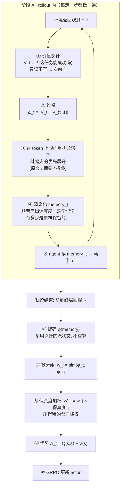

# Memory 压缩软分组信用分配 —— 价值失真记忆树

## 1. 问题定位与动机链条

### 1.1 场景

agentic RL，单智能体多轮交互，**稀疏轨迹奖励** → 需要把功劳/罪责摊到每一步（credit assignment, CA）。主流范式是**分组式 CA**：把"处于相同处境"的多次决策凑成组，组内比不同动作的回报 → 得到每步优势（GiGPO / HGPO / BiPACE / GraphGPO / G2PO / GEPO 一系）。

### 1.2 两条动机：省 token（必需）+ 提纯信号（有益）

#### 动机一 · token 硬上限 —— 压缩是**必需的**

> LLM agent 的 context 有**硬上限**（token 数）。长程任务的完整交互历史必然超限。压缩不是"为了让记忆算法更好学"，而是**物理上非压不可**。

**推论**：既然是 token 硬上限，压缩就必须是**固定 token 上限**，不能是固定比例——固定比例下 token 仍随轨迹长度线性增长，照样超限。

#### 动机二 · 冗余会**主动干扰**信用分配 —— 压缩是**有益的** ★论文卖点

这条比第一条强：全历史里的无关内容不只占地方，还会**淹没**"这一步重不重要"的信号。三条独立证据：

| 来源 | 发现 |
|---|---|
| 本课题旧诊断（合成） | 原始不压 sep-AUC **0.52~0.67** → 忠实压缩 **0.93** |
| 本课题 `value_tree_test`（3 seeds） | raw（全历史）**0.939** < vtree（压缩）**0.969** —— **压完反超全历史** |
| MemoPilot Table 1 | Full History 的成绩**低于** selective memory，作者据此论证"需要 selective memory" |

**动机一说"不得不压"，动机二说"压了更好"。后者才是论文真正的主张，也是必须拿实验证明的东西**（见 §6 实验③、⑤ 与阶段 3 的验收）。

#### ⚠️ Ni 2023 的边界在哪（这条要讲准，否则会被反问倒）

**Ni et al. 2023**（记忆与信用分配解耦）用 Passive/Active T-Maze 证明：Transformer 靠大 context 就能解到 1500 步的记忆任务。

它打掉的是这条论证：~~"长程记忆很难学 ⇒ 所以要压缩"~~ —— 记忆算法本身不是瓶颈。

**但它打不掉动机二**：Ni 证的是"**记得住**"，不是"**全记着对下游最好**"。

> **记得住 ≠ 分得对信用**

Transformer 能把 1500 步前的线索**取回来**，不等于在一堆流水账里还能**判准哪一步立了功**。上表三条证据说的正是后者。

### 1.3 空档在哪

已阅读24 篇 memory 压缩论文（ICML 2026 folder 30 等），目标清一色是"压完还能**检索** / **答题** / **拿任务奖励**"。

**没有一篇是为了"压完还能把信用分对"去压的。** 压缩的**目标函数**这一格是空的。

### 1.4 为什么值得做

**BiPACE 结论节原文**：

> *"extending the bisimulation-guided grouping to agents that **compress history into a memory module** (where direct observation hashing is intractable) is an interesting avenue for future work."*

**HGPO** 也承认：一旦历史被 memory 模块压缩，层级分组变得 intractable。

**Mem-T / MemoPilot**（都做"用 RL 学 selective memory"）：MemoPilot 自认 Limitation 2 —— 长程上下文的压缩**被外包给预处理，不是端到端学的**。

→ 这三家共同留下的空位。

---

## 2. 方法：价值失真记忆树

> 💻 **实现见 [`落地实现方案.md`](落地实现方案.md)**（架构 / 模块接口 / 接进 verl-agent 的挂载点 / 三阶段路线），核心模块已落地为 [`vtree_compressor.py`](vtree_compressor.py)。

### 2.1 整体流程

分两个阶段。**关键：压缩发生在 rollout *内部*，不是跑完再压**——因为 agent 决策时看到的就必须是压缩后的 memory，否则它照样超 context（见 `落地实现方案.md` §0）。



**每个环节的开销**（详见 `落地实现方案.md` §2）：

| 环节 | 何时 | 要不要"生成文字" | 开销 |
|---|---|---|---|
| ① 探针 | 每步 | ❌ 只读，答一个字 | 小；复用 agent 的 KV cache 后趋近 0 |
| ② 跳幅 | 每步 | ❌ 一次减法 | 0 |
| ③ 重排分辨率 | 每步 | ❌ 排序 + 贪心 | 0（纯 CPU） |
| ④ 渲染 | 每步 | 折叠/截断 ❌；LLM 摘要 ✅ | 默认 0；LLM 版可异步 |
| ⑥ 编码 | 轨迹后 | ❌ | 0（复用①的隐状态） |
| ⑦⑧⑨ 分组与优势 | 轨迹后 | ❌ 矩阵运算 | 0 |

**新旧分工**：⑥–⑩ 是**借来的容器**（GiGPO / BiPACE / HGPO）；**①–④ 是创新的一块**，且是让 ⑦ 凑得成堆的前提。⑦⑧⑨ 具体怎么改见 §3。

**注意 ④ 那个"顺带产出"**：**保真度**不是额外算的，是压缩过程本身就知道的（每步落在哪一档）。它一路带到 ⑧ 去给邻居降权——**这就是压缩和信用分配咬合的地方**（§3.3）。

### 2.2 步骤①：价值信号

#### 先定尺子：用「价值」不用「信念」

压缩的判据可以是两种量，必须先选定：

| | 是什么 | 例子 |
|---|---|---|
| **信念** | 对隐藏事实的猜测 | "宝藏在上侧"——知道了一件新事 |
| **价值** ⭐ | 对**能否成功**的预期 | "这任务有七成把握" |

两者常同步变，但会分家：**"前方塌方封路"**——信念没变（目的地还在原处），价值暴跌；**"朋友养了只猫"**——信念变了（多知道一件事），价值毫无变化。

**选价值，三条理由**：

1. **同量纲**：本方法要保住的是**信用**，而信用 = 优势 = 价值之差。判据和目标同量纲，才接得上理论（§4 的 IB 框架、Abel 的价值损失界）；
2. **避开占位**："按信念变化压"已被 **∆Belief-RL** 占了；
3. **该压的能压掉**："养了猫"这类信念变、价值不变的信息**不该保留**——用信念当judge就会把它留下。

**信念不是竞品，是价值变化的原因**：读到线索 → 信念变 → **所以**价值变。论文里可以把 ∆Belief-RL 收编成一个特例，而不是对手。

$$V_t = P\big(\text{success} \mid m_t\big)$$

其中 $m_t$ = 前 $t$ 步的记忆，$V_t$ = 模型认为任务最终能成功的概率。

#### $V_t$ 具体怎么算出来的

**一句话：不让模型把答案写出来，只看它"心里更想写'是'还是'否'"、倾向有多强。**

**① 拼一道填空题**

```
任务：加热番茄
当前记忆：
  你在厨房里四处找番茄
  找到并拿起生番茄
  手拿生的番茄，走到微波炉前

问：这个任务最终能成功吗？只回答一个字：是 或 否。
答：___
```

**② 模型读一遍，在真正落笔前，它对"这个空填什么"已经有一张倾向表**

| 候选字 | 倾向 |
|---|---|
| **是** | 0.28 |
| **否** | 0.12 |
| 这 | 0.15 |
| 应 | 0.09 |
| …（其余数万字） | … |

**③ 只取"是 / 否"两行，归一化**

$$V_t=\frac{p_{+}}{p_{+}+p_{-}}=\frac{0.28}{0.28+0.12}=0.70$$

（$p_{+}$、$p_{-}$ 分别是模型倾向填「是」「否」的分数。）

```python
lg = model(**enc).logits[:, -1, :]            # -1 = 最后一个位置 = 那个空
V  = softmax(lg[:, [yes_id, no_id]])[:, 0]    # 只在"是/否"之间比
```

#### 三个设计考虑

| 做法 | 为什么 |
|---|---|
| **只取"是/否"的相对值**，不用绝对概率 | 模型可能想说"这个""应该""不一定"，绝对概率被这些分掉。只在两者间比 = "被迫二选一时它偏哪边"，排除干扰 |
| **不让它真写出来** | 写 = 逐字生成，慢；读完取倾向表 = **一次前向**，快一个量级。这是探针便宜的根本原因 |
| **拿到的是连续值**，不是硬的是/否 | $V=0.70$ 比 $V=0.51$ 信心更强。**跳幅正是靠这个连续性才算得出来**——若只有离散的是/否，$\Delta_t$ 就只剩 0 和 1，全废 |

#### ⚠️ 它测的不是真实概率

$V_t$ 是**模型的主观判断**，很可能系统性偏乐观（LLM 普遍倾向答"是"）——实际成功率 50% 的处境它可能给 0.7。

**但这不影响方法**：我们只用**跳幅**（相对变化），不用绝对值。只要能分出"这步比那步跳得多"，排序对了就够。

**"排序对不对"本身是假设** → 实验②专门验它（见 §6）。

---

**为什么用问模型而不是别的**：

| 候选 | 为什么不用 |
|---|---|
| 训价值网络（critic） | 主线全是 critic-free，引入 critic 与容器不兼容、多一个失败点，且"critic 准不准"只是把问题转移 |
| 蒙特卡洛真实回报 | **稀疏奖励下退化**：$R_t=\gamma^{T-t}R_{\text{final}}$ 单调，跳幅 $=\gamma^{T-t}(1-\gamma)R_{\text{final}}$ 纯粹是"离终点多远"的函数 → **直接撞 GraphGPO 的最短距离** |

**为什么问模型是可接受的**：压缩是**预处理**，不参与梯度、不进 loss，所以只需要**排序对**（能分出哪步跳得更大），不需要绝对精确。

**这条假设必须被验证**，见 §6 实验②。

#### 顺带定死一件事：不做迭代循环

"组内分歧"那条备选信号会引出一个循环——**要知道组内有没有分歧，得先能认出同一处境；而认处境靠的是 memory，memory 又正是要压的东西**。于是变成：粗压 → 分组 → 看分歧 → 重压 → 再分组……

**不做。** 两条理由：

- **主故事必须一句话讲得清**："按价值跳幅分配 token" vs "先粗压、再分组、看分歧、重定跳幅、再压、再分组……"——后者听的人已经晕了；
- **收敛性说不清就是硬伤**：审稿人必问"这个循环收敛吗、会不会震荡"，要答上来是另一篇论文的工作量。

**问大模型这条路一遍过、无循环**，这也是选它当主线的隐含理由之一。组内分歧留作讨论与可选消融。

### 2.3 步骤②：跳幅

$$\Delta_t = \big|V_t - V_{t-1}\big|,\qquad V_{-1} := 0.5$$

（$V_{-1}=0.5$ 是先验：还没看任何观测时，成败五五开。）

$\Delta_t$ 大 = 这一步让"能不能成"的判断剧变 = **决策关键步**，该保细节；
$\Delta_t \approx 0$ = 流水账，该狠压。

**这个量的血统**：**PER**（Prioritized Experience Replay）已经在按 TD-error（= 价值惊讶）分配**回放优先级**；本方法把同一原则从"回放优先级"升级成"**压缩分辨率**"。同一句话"把资源砸在意外/重要处"，换了作用对象。

#### 为什么用「跳幅」当规则，而不用「压掉后判断变不变」

还有一个看起来更直接的判据：**把这段压掉，再问一遍模型——判断变了就说明它重要**。但它只能当**评估指标**，不能当压缩规则：

| | 用途 | 为什么 |
|---|---|---|
| **跳幅**（读书时划重点） | ✅ **压缩规则** | 边读边判断，**一遍过** |
| 压掉后判断变不变（划完盖住考自己） | ✅ 评估指标<br>❌ 压缩规则 | ① 它正是**另一条候选路线「因果充分压缩」的定义**（删掉这条记忆、决策会不会变？会变才留）——当规则会让本方法**塌成它**；② 每试一种压法都要重问一遍模型，**贵得离谱** |

但它不该丢掉——**它是 IB 里"失真"的正统定义**，正好拿来当评价体系：*我的压缩让价值判断偏了多少*。

**一句话**：跳幅是划重点的笔，"压掉后判断变不变"是检验划得对不对的考试。用笔的时候不考试，考试只在最后验收。

### 2.4 步骤③：三档分辨率 + 树 ★核心创新

**不是"留 / 删"两档开关，而是多档**：

| 跳幅 | 处理 | 树上位置 |
|---|---|---|
| 大 | **原文一字不差** | 叶子 |
| 中 | **压成一句摘要** | 中间层 |
| 小（连续低跳幅段） | **整段合并成一句** | 靠近根 |

**树是这么冒出来的**：把连续的低跳幅步捏成一个包，这个包就是树上的一个节点。

```
             整条轨迹（根：一句话）
            /        |          \
      [找番茄]     加热!        [放桌上]      ← 中间高跳幅 → 单独一片叶子
      / | \                     /  \            两边低跳幅 → 捏成包
     8步细节                   5步细节          ← 想看细节可以展开
```

**压缩 = 决定每个分支展开到第几层。** 关键处展到叶子，流水账停在中间层。

**为什么要中间档 —— 三条技术理由**（不是"为了新"）：

**① token 利用率：两档是 0-1 背包，零头用不掉**

两档下每步要么全占 token 上限、要么完全不占。当剩余 token 装不下某步的原文时，这步只能整条丢，剩的零头浪费。中间档能用这点零头保住主干。

**实测**（`vtree_compressor.py` 自测场景 4）。测试轨迹共 10 步，其中三条是**有用线索**、其余是无关的走廊描述（跳幅为 0）：

| 线索 | 内容 | 跳幅 $\Delta$ | 原文 | 摘要后 |
|---|---|---|---|---|
| **A** | 【线索A】钥匙藏在**红色**柜子里 | **0.40**（最重要） | 22 字 | 9 字 |
| **B** | 【线索B】**红色**柜子放在**二楼** | 0.25 | 20 字 | 9 字 |
| **C** | 【线索C】地上有张纸条，字迹模糊 | 0.07（最不重要） | 21 字 | 9 字 |

"保住 A B C" = 压缩后这几条线索仍在 memory 里（原文或摘要形式）。

| token 上限 | 三档保住 | 两档保住 | |
|---|---|---|---|
| 200 / 140 | A B C | A B C | token 充足，三条原文都装得下 → 两者相同 |
| **110** | **A B C** | A B | **三档多一条**：C 的原文（21 字）塞不下，但摘要（9 字）塞得下；两档没有降级选项，只能整条丢 |
| 90 | A B | A B | 相同 |
| **70** | **A B** | A | **三档多一条**：同理，B 降级为摘要保住了 |
| 50 | A | A | token 极紧，连 A 都勉强 → 两者相同 |

**② 失真应当渐变，不该是阶跃**

价值跳幅 $\Delta_t$ 是**连续量**。两档等于把它强行二值化，卡在阈值附近的步被迫"要么全保要么全丢"。率失真理论的基本精神是"**用多少比特传**"，不是"传或不传"——中间档让中等重要的步得到中等分辨率。

**③ 保真度需要分辨率 —— 这是 §3.2② 的前提条件**

两档下，被删的步**根本不在 memory 里**，不参与分组，保真度退化成"在 / 不在"，保真度加权无从谈起。

**只有三档才存在"在、但不可靠"这个状态**（摘要档，保真度 $=0.6$）——而 §3.2② 那条"压得粗的邻居降权"正是靠它。**中间档不是装饰，是 CA 侧那条创新的必要条件。**

**代价与边界（诚实说）**：

- 多一个摘要器组件，多一个失败点；
- **摘要改写错比直接删更隐蔽**——删掉了你知道它没了，改错了你以为还在；
- **token 充足或极紧时，三档 $=$ 两档**（见上表）。优势只在**中间区间**。如果实际部署的 token 上限总是很宽裕，中间档确实是多余的。

**成本对账（实测后补）**：中间档的摘要**必须零成本**。实测让 LLM 写一句摘要要 ~1.3 秒，**占一次决策的 70.7%**（`bench_probe.py`），每步做一次就接近总时长翻倍。
所幸这不伤核心：自测已验证**换摘要器不改变档位分配**——牺牲的只是摘要文字质量，不是分辨率分配能力。

### 2.5 固定 token 上限的贪心分配

**给定 token 上限 $B$**（如 512 token，与 MemoPilot 对齐）：

1. 按 $\Delta_t$ 从大到小排队；
2. 依次花 token 把该步展开到最细（原文）；
3. token 不够展原文时降档（摘要）；
4. token 用尽 → 剩余步全部捏成一句。

**这一步白送的东西**：token 上限固定 ⇒ 各档必须**互相竞争** ⇒ 压缩率可连续调节 ⇒ **这就是 IB 里 $\beta$ 旋钮的物理意义**（见 §4）。固定比例给不了这个，因为每条轨迹各留各的，互不相干。

**两处实现细节**（`vtree_compressor.py` 里踩出来的）：

- **当前步不占历史 token 上限**：最后一步永远是原文（agent 要拿它决策）。若让它挤占 token 上限，当前观测一长（网页文本）就会把关键步挤掉，出现"token 上限越紧越丢关键步"的反向行为。
- **跳幅 $\approx 0$ 的步不升档**：即使token 有富余也不给它。否则贪心会把token 上限花光在零信息的步上，token 曲线虚高，违背"比特花在影响决策处"。

### 2.6 跟着一条轨迹走一遍（加热番茄，token 上限 65）

**阶段 A：rollout 内，每走一步做一遍 ①→④**

| $t$ | 观测 | $V_t$ | $\Delta_t$ | 最终档位 | 保真度 |
|---|---|---|---|---|---|
| 0 | 你在厨房里四处找番茄 | 0.35 | **0.15** | **F** 原文 | 1.0 |
| 1 | 在料理台找到并拿起了生的番茄 | 0.55 | **0.20** | **S** 摘要 | 0.6 |
| 2 | 手拿生的番茄，走到微波炉前 | 0.60 | 0.05 | **F** 原文 | 1.0 |
| 3 | 打开微波炉，把生的番茄放了进去 | 0.85 | **0.25** ★ | **F** 原文 | 1.0 |
| 4 | 微波炉加热完成，番茄已经是热的，拿在手上 | 0.92 | 0.07 | **M** 折叠 | 0.3 |
| 5 | 手拿热的番茄，走向桌子 | 0.93 | 0.01 | **M** 折叠 | 0.3 |
| 6 | 把热的番茄放到桌上，任务完成 | 0.99 | 0.06 | **F**（当前步恒原文） | 1.0 |

（$V_{-1}=0.5$ 是先验，所以 $\Delta_0=|0.35-0.5|=0.15$。）

**第 3 步跳幅最大**（0.60 → 0.85）——"把番茄放进微波炉"是这条轨迹的命门，探针也这么认为。它第一个被展开成原文。

第 6 步渲染出来的 memory：

```
你在厨房里四处找番茄
找到并拿起生番茄
手拿生的番茄，走到微波炉前
打开微波炉，把生的番茄放了进去
(此处 2 步例行操作已折叠)
把热的番茄放到桌上，任务完成
```

**树在哪里？** 渲染结果是**线性文本**，看不出层级——但每一行的**详细程度不同**，那就是树的痕迹：

```
渲染出的 memory                        这一行在树上的位置
─────────────────────────────────     ──────────────────────
你在厨房里四处找番茄                ←  叶子（展开到底）
找到并拿起生番茄                    ←  中间层（停在这里没往下展）
手拿生的番茄，走到微波炉前           ←  叶子
打开微波炉，把生的番茄放了进去        ←  叶子
(此处 2 步例行操作已折叠)            ←  内部节点（整棵子树收成一句）
把热的番茄放到桌上，任务完成          ←  叶子（当前步必须展开）
```

对应的树：

```
                     整条轨迹（根）
     ┌─────┬─────┬─────┬─────┬───────────┬─────┐
    步0   步1   步2   步3    [步4,步5]    步6
     │     │     │     │         │        │
    原文  摘要  原文  原文    折叠成一句   原文
    叶子  中间层 叶子  叶子     内部节点    叶子
```

**「(此处 2 步例行操作已折叠)」那一行就是一个内部节点**——它代表底下两个子节点被收起来了，需要时可以展开。

所以「树」不是另外画一张图，而是**"每一行详细到什么程度"这件事本身**。$\S2.4$ 那棵示意树，落到文本上就长这样。

**两个反直觉但正确的地方**：

- **第 4 步跳幅（0.07）比第 2 步（0.05）大，却被压得更狠**。原因是第 4 步的原文长（19 字）、第 2 步短（13 字）——同样的token 上限，短的装得下、长的装不下。**长度参与了竞争**。
  > ⚠️ 当前实现是**纯按跳幅**排序，长度只在"装不装得下"时起作用。更合理的是按**性价比** $\Delta_t / \text{len}_t$ 排序——这是一个明确的改进点，还没做。
- **第 5 步跳幅 0.01 被直接判为零信息**，不参与竞争（`min_jump` 阈值）。

**阶段 B：轨迹结束后，做 ⑥→⑩**

同一批 rollout 里，跑了 4 条轨迹，都经过"手拿生番茄站在微波炉前"这个处境，但**下一步动作不同**：

| 轨迹 | 在该处境的动作 | 终局回报 $R$ | 该步 **保真度** |
|---|---|---|---|
| #1 | 放进微波炉 | 1（成功） | 1.0（原文） |
| #2 | 放进微波炉 | 1（成功） | 1.0（原文） |
| #3 | 走开去拿别的 | 0（失败） | 1.0（原文） |
| #4 | 放进微波炉 | 0（失败，后面出错） | **0.3（被折叠）** |

- **⑦ 软分组**：四条的 $\varphi(\text{memory})$ 互相相似 → 权重 $w_j$ 高，凑成一堆；
- **⑧ 保真度加权**：#4 那步被压到折叠档、memory 不可靠 → $w'_4 = w_4\times 0.3$ **降权**，防止它把噪声灌进基准；
- **⑨ 算优势**：
  - $\hat V(s)=\sum_j w'_j R_j$ ≈ 加权平均回报（约 0.6）
  - $\hat Q(s,a)$ 取 $a=$「放进微波炉」时 = 只看同样做这个动作的邻居 ≈ 0.7
  - $A=\hat Q-\hat V\approx +0.1$ → **"放进微波炉"这个动作拿到正信用**；
  - 对 #3 的"走开"：$\hat Q\approx 0$，$A\approx-0.6$ → **负信用**。

**这里就能看出保真度加权的作用**：如果不按保真度降 #4 的权，它那条"放进微波炉却失败了"的记录会把 $\hat Q$ 拉低，让正确动作的信用变小。而 #4 之所以失败，很可能与该处境无关（后面才出的错）——它的 memory 又恰好被压得最粗、最不可信。**保真度加权让这条噪声的影响自动变小。**

---

## 3. 压完之后：软分组信用分配

压缩只是底座，**信用分配（CA）才是最终要交付的东西**——而压缩恰恰改变了 CA 的工作条件，所以这一层必须跟着改。

### 3.1 为什么压完之后 CA 必须改

| 压缩带来的变化 | 对 CA 的影响 |
|---|---|
| memory 不再是原始观测 | GiGPO 的**精确哈希分组**（观测一字不差才同组）**直接失效** |
| 压缩有损，且**每步损失程度不同** | 关键步保得细、流水账压得狠 → 同一条轨迹里 memory 的**可靠度不均匀** |
| 树有多个分辨率层 | 天然提供**层级结构**，可直接喂给层级式聚合 |

第二条是压缩独有的新问题：**从压糊的 memory 状态算出来的信用会污染训练**。现有方法都默认所有状态一样可信，压缩之后这个假设不成立。

### 3.2 四条改法（可组合）

**① 软成员优势** —— 不硬分组，用 memory 相似度做核加权：

$$\hat{V}(s)=\sum_j w_j R_j,\qquad \hat{Q}(s,a)=\sum_{j:\,a_j=a} w_j R_j,\qquad w_j=\mathrm{sim}\big(\varphi(m),\,\varphi(m_j)\big)$$

是 BiPACE 硬阈值聚类的自然软化——它 $d_{\cos}\le\varepsilon$ 一刀切，这里是连续权重。

**核宽 $\tau$ 应当自适应，不能写死。** BiPACE 自认的软肋之一就是"$\varepsilon$ 一次性标定、不自适应"；更实际的问题是**训练中表示空间会漂移**——训练前标定的 $\varepsilon=0.10$，跑几百步后表示变了，"0.10 有多近"已不是原来的含义，等于拿旧尺子量新东西。三种做法：

| | 公式 | 解决什么 | 定位 |
|---|---|---|---|
| **A. 分位数** | $\tau=Q_p(\{d_{ij}\}),\ p\approx0.2$ | **尺度漂移**：量的始终是"在当前这批里算不算近"，相对而非绝对 | ⭐ **默认** |
| **B. k-NN** | $\tau_i=d(\varphi_i,\varphi_{(k)})$ | 密度不均：稠密处自动收紧、稀疏处放宽（t-SNE 的 perplexity 思路） | 暂不做 |
| **C. 保真度** | $\tau_i=\tau_0/F_i$ 或 $\tau_0\cdot F_i$ | 压得狠的点该**放宽**还是**收紧**——**方向未定，见下** | ⭐ 消融项（两个方向都试） |

**⚠️ C 的方向是个未解问题，两种直觉都成立：**

| 视角 | 压缩造成什么 | 该怎么调 |
|---|---|---|
| **噪声视角** | 表示在真值附近**随机抖动** ⇒ 距离测不准 ⇒ 别死卡阈值，多取几个平均掉噪声 | $\tau_i=\tau_0/F_i$ **放宽** |
| **坍缩视角** | 表示**系统性失去区分度**（都变成"在厨房操作了一番"这种谁看都像的）⇒ 放宽只会把不同处境并成一簇 | $\tau_i=\tau_0\cdot F_i$ **收紧** |

**旧诊断的证据偏向「收紧」**（§9.4）：

> 压缩后短文本的隐状态被挤进一个很窄的**锥形**里……固定阈值的贪心聚类会一刀切、**把不同处境全并成一簇**。

"并成一簇"就是假阳性 —— 这种情况下放宽只会更糟。

**但收紧也有代价**：表示一旦坍缩，"谁离我最近"这个排序本身就不可信；$\tau$ 太小等于**把权重全押在一个不可信的第一名上**，方差反而更大。

$$\text{假阳性风险} \to \text{收紧}\qquad\text{押错单个邻居的风险} \to \text{放宽}$$

**两种风险在坍缩时同时存在，推理定不下来 → 消融时两个方向都跑。** 这也正是它只能当消融项、不能当定案的原因。

---

**C 只有做压缩的方法能做**，而且它和 ②的"降权"是**两种不同的机制**：

| | 做什么 | 含义 |
|---|---|---|
| ② 降权 | $w'_j=w_j\times F_j$ | 这个邻居**少听一点** |
| **C 调核宽** | $\tau_i\propto 1/F_i$ | **"多远算近"的标准变了** |

方向甚至相反：压得狠的点，降权是"少信它"，调核宽是"**放宽**对它的距离要求"（因为它的距离测不准）。所以 C 值得单独验——它可能比降权更站得住（`walkthrough.py` 已观察到降权在某些情形下是冗余的，见 §8 风险⑥）。

⚠️ **位置要摆对**：这三条都是 **CA 侧**的改进，不是压缩侧的。创新须落在压缩方法本身，所以自适应核宽**只能是加分项**——若它成了主要卖点，故事就滑回"改进 BiPACE 的分组"，那正是已被占位的老方向。

**② 保真度 / 不确定性加权** ★压缩方案独有的增量

每个邻居的贡献再乘一个"可信度"：

$$w'_j=w_j\cdot F_j$$

$F_j$ = 记忆 $m_j$ 的保真度（定义见下）。

#### 保真度怎么算（代码里叫 `conf`，见 `vtree_compressor.py: fidelity()`）

**第一步：每一步先按它落在哪一档打分**

| 档位 | 含义 | 分数 $c_t$ |
|---|---|---|
| 原文（叶子） | 一字未改 | **1.0** |
| 摘要（中间层） | 保住主干、丢了细节 | **0.6** |
| 折叠（近根） | 只剩"此处 N 步已折叠" | **0.3** |

**第二步：整段取加权平均**

$$F=\frac{\sum_t w_t\, c_t}{\sum_t w_t}$$

$F$ = 整段记忆的保真度；$w_t$ = 第 $t$ 步原文的 token 数；$c_t$ = 该步的档位分。

**数字例子**（`walkthrough.py` 里 #4 那条走到第 2 步时）：

| 步 | 内容 | 原文长度 $w_t$ | 档位 | $c_t$ |
|---|---|---|---|---|
| 0 | 你在厨房里四处找番茄 | 10 | **折叠** | 0.3 |
| 1 | 在料理台找到并拿起了生的番茄 | 14 | 原文 | 1.0 |
| 2 | 手拿生的番茄，走到微波炉前 | 13 | 原文 | 1.0 |

$$F=\frac{10\times0.3+14\times1.0+13\times1.0}{10+14+13}=\frac{30}{37}=0.81$$

（同批的 #1/#2/#3 三步全是原文，保真度 $=1.00$。）

**两个设计点**

- **为什么是"整段"而不是"某一步"**：分组用的表示是**整段 memory**（该步当时的历史前缀），可靠性自然取决于整段被压得多狠。而且**当前步恒为原文**，若取单步档位，保真度恒等于 1.0，毫无区分度。
- **为什么按长度加权**：压掉一个 100 字的步，比压掉一个 10 字的步丢得多；简单平均会把两者当成一样。

#### ⚠️ 这个定义有缺陷：它惩罚了正确的压缩

上例中 #4 被折叠的是**第 0 步**，而那一步的跳幅是 $\Delta_0=0.00$ —— 探针看完它判断毫无变化，**这一步本来就没信息**。

**压掉一个零信息的步，不该损失任何保真度**；可现在的算法照样把它从 1.00 扣到 0.81 —— **等于在惩罚方法做对的事**。

**修正：权重从"长度"换成"跳幅"**

$$F=\frac{\sum_t \Delta_t\, c_t}{\sum_t \Delta_t}
\quad\Rightarrow\quad
\frac{0.00\times0.3+0.02\times1.0+0.02\times1.0}{0.00+0.02+0.02}=1.00\ \checkmark$$

| | 保真度低意味着 |
|---|---|
| 按长度（现实现） | **字数**丢得多 |
| **按跳幅（修正）** | **信息**丢得多 ✅ |

保真度的本意是"这份记忆对**信用**的判断力还剩多少"，显然该是后者。修正后它只在一种情况下下降：**token 不够，被迫丢掉了跳幅大的步**——那才是真正该警惕的。

> **状态**：代码仍是按长度加权（`fidelity()` 用 `_n_full` 当权重）。改成按跳幅只需换一行，但会改变已有演示的数字，**待定**。

**为什么只有压缩方案能做这一条**：**保真度** 需要知道"哪一步压得狠、哪一步保得细"——**这正是记忆树的副产物**（每步落在树的第几层是压缩过程直接给出的）。不做压缩的方法根本没有这个信息。→ **防止从压糊的状态泄漏错误信用。**

**③ 动作反事实（借 BiPACE 的 PACE）** —— 软组内按执行动作拆分：

$$A_t=\hat{Q}(s,a)-\hat{V}(s)$$

隔离动作专属的信用，避免"同状态不同动作共享一个基准"的错配。

**④ 多粒度融合** —— episode 级（GRPO）+ memory 组级（①②）+ 动作级（③），按不确定性自适应加权。

**这一条正好吃掉树的多分辨率结构**：树的粗层 ↔ 大粒度组，细层 ↔ 小粒度组——等于把 HGPO 的层级从"历史步数"迁到"**压缩分辨率**"上。

### 3.3 压缩 + CA 的完整流程

```
交互历史 h₁..ₜ
   │
   ▼
┌────────────────────────────────────────┐
│ ① 价值失真记忆树压缩  (§2)              │  逐前缀问价值 → 跳幅 → 固定token 上限下三档分辨率
│    mₜ = VTree(h₁..ₜ ; token 上限 B)           │  ★ 创新主体
└────────────────────────────────────────┘
   │  取表示 φ(mₜ)
   │  ★副产物: 每步落在树的第几层 → 保真度(mₜ)
   ▼
┌────────────────────────────────────────┐
│ ② memory 空间相似度软分组               │  wⱼ = sim(φₜ, φⱼ)，不做精确匹配
└────────────────────────────────────────┘
   │
   ▼
┌────────────────────────────────────────┐
│ ③ 保真度 / 不确定性加权                 │  w'ⱼ = wⱼ · 保真度(mⱼ)
│                                        │  压得粗的步降权 → 防信用泄漏
└────────────────────────────────────────┘
   │
   ▼
┌────────────────────────────────────────┐
│ ④ CA 优势（软成员 + 动作反事实）         │  Aₜ = Q̂(s,a) − V̂(s)
└────────────────────────────────────────┘
   │
   ▼
group-based RL 更新（GRPO / GiGPO 家族）
```

**这张图里压缩和 CA 是咬合的，不是前后两段**：①的副产物 **保真度** 直接喂给③——**压缩过程本身产出了 CA 需要的可信度信息**。这是"先压再分"相比"只压"或"只分"多出来的东西。

### 3.4 与已有工作留下的空位对应

| 步 | 对应谁的 future work |
|---|---|
| ① 压缩 | BiPACE：*"…agents that compress history into a memory module…"* |
| ② 软分组 | HGPO：*"…explore other ways for hierarchical grouping, e.g., the embedding similarity of the memory."* |
| ③ 保真度加权 | HGPO：*"…adaptive weighting scheme… considering the uncertainty of the advantage estimate."* |
| ④ CA 优势 | 本体，借 GiGPO / PACE 的容器 |

---

## 4. 数学骨架：信息瓶颈（IB）

$$\min_{p(t\mid x)}\ \ I(X;T) - \beta\, I(T;Y)$$

**本方法是 IB 的一个实例化**：

| IB | 本方法 |
|---|---|
| 输入 $X$ | 完整交互历史 |
| 压缩表示 $T$ | 压缩后的 memory |
| 任务目标 $Y$ | **信用 / 价值** ← **换掉的就是这一格** |
| $I(X;T)$（要 min） | memory 占多少 token |
| $I(T;Y)$（要 max） | memory 对信用分配还剩多少判断力 |
| $\beta$ | **token 上限旋钮**（§2.5） |

$$\min_{p(m\mid h)}\ \underbrace{I(H;M)}_{\text{token cost}} \;-\; \beta\,\underbrace{I(M;C)}_{\text{credit info}}$$

$H$ = 完整历史，$M$ = 压缩后的 memory，$C$ = 信用。第一项要小（省 token），第二项要大（保住信用判断力）。

**立足点要讲清**：本方法不是发明 IB（1999 年的成熟框架），新的是这三点：
1. 把 IB 的 $Y$ **换成信用/价值** —— CA 主线五篇都没用过 IB；
2. 用 **PER 的价值跳幅**把 IB 抽象的 $D_{\text{KL}}$ 失真落地成可逐步算的量；
3. **理论亲戚**：Abel 的保价值抽象证明"合并价值相近的状态，价值损失有界" → 可改写成"**压缩到什么程度，信用误差有界**"，这是本方法潜在的理论卖点。

---

## 5. 与邻居的界限（逐个划清）

| 论文 | 它做什么 | **和本方法的分界线** |
|---|---|---|
| **BiPACE** | 隐状态 cosine 软聚类分组 + 动作反事实 | ① 它是**横向**合并状态空间，本方法是**纵向**变时间轴粒度；② 它挂 bisimulation 的名、干 **朴素 cosine** 的事（不查奖励/转移/递归/无理论保证），本方法用价值跳幅比它更接近"保价值合并"；③ **它自己把这个方向写成 future work** |
| **HGPO** | 层级分组（历史步数分层） | 承认 memory 压缩后层级分组 intractable；本方法的树的粗/细层正好可以当它的层级 |
| **GraphGPO** | 状态转移图 + 反向 Dijkstra 距离 | **最危险的碰撞**：若本方法用 MC 回报当价值，跳幅退化成"离终点多远"= GraphGPO。**这正是 §2.2 排除 MC 回报的直接原因** |
| **G2PO / GEPO** | 图上做信用分配（边 TD / 介数中心性×语义） | 都在**单局内做信用分配**，不碰压缩；且 G2PO 用 truncate 处理长序列 → 本方法的 T-maze 实验正是打它这个地基 |
| **∆Belief-RL** | 按**信念变化**做信号 | **§2.2「用价值不用信念」就是为躲它**：本方法锚价值不锚信念，且把信念收编为"价值变化的原因" |
| **MemoPilot** | 训记忆模型写 selective memory，多轮 GRPO | ① **轮级**（一局一份笔记）vs 本方法**步级**；② 自认 Limitation 2：长程压缩靠预处理、非端到端 → **本方法就是它这条 limitation 的答案**；③ 它的"Full History 反而更差"是本方法动机的现成实验证据 |
| **Mem-T** | MoT 树把终局分稠密化 + hindsight 回传到记忆操作 | 信号是 **QA 的 F1 / 证据密度（文本重合）** → 压缩改变文本后信号就失灵，所以它把压缩推给预处理。本方法用**不依赖文本表面**的价值跳幅，压缩才可学 |
| **HIPIF** | 分层规划 + 子目标完成后折叠历史 | **事件驱动**（子目标做完就折叠）vs 本方法**信用驱动**；**子目标级整块折叠** vs 本方法**步级连续粒度**。子目标内部关键步和平坦步混着，一刀切会连关键步一起折 |
| **RGMem / Memora** | 多尺度粗粒化 / 抽象-具体平衡 | 壳一样（多分辨率），**目标不同**：它们为检索/个性化，本方法为信用 |
| **PER** | 按 TD-error 分配回放优先级 | **本方法的种子**，不是竞品：同一原则从"复习谁"换成"压谁" |
| **Ferns / DBC / MICo** | bisimulation 度量（行为等价） | **方法论模板，不是公式套用**：借它们"距离由任务定义、从采样中学、省算力但保上界"这套做法；本方法的距离是价值跳幅，不是 $\mid R\mid+\gamma W_1$ |
| **RUDDER / CCA** | 回报分解 / 反事实信用 | RUDDER 的"哪步让预测突变"= 跳幅的另一种算法（LSTM 而非问模型），可当备选量法；CCA 是「因果充分压缩」那条路线的主干 |

---

## 6. 实验设计（四项，按优先级）

### ① `tmaze_text_test.py` —— 动机图 ✅【已跑完】

**证三条**：① truncate 会崩（trunc-$k$ 在 $L>k$ 断崖到 0.5）② 压缩不崩（vtree ~1.0）③ **压缩省 token（vtree 平线 vs full 线性爆炸）**。

**设置**：Qwen2.5-7B-Instruct（4bit），$N=100$ / seed，3 seeds，$\tau_{\text{jump}}=0.25$。第 0 步**不**无条件保留（线索恰在第 0 步，硬留等于送答案），凭跳幅自选。

**结果 1 · 决策准确率（mean ± std over 3 seeds）**

| $L$ | no_mem | full | **vtree_val** | **vtree_bel** | trunc2 | trunc8 |
|---|---|---|---|---|---|---|
| 1 | 0.51±.02 | 1.00±.00 | **1.00±.00** | **1.00±.00** | 1.00±.00 | 1.00±.00 |
| 2 | 0.45±.02 | 1.00±.00 | **1.00±.00** | **1.00±.00** | **0.45±.02** ⬇ | 1.00±.00 |
| 4 | 0.51±.04 | 1.00±.00 | **1.00±.00** | **1.00±.00** | 0.51±.04 | 1.00±.00 |
| 8 | 0.51±.03 | 1.00±.00 | **1.00±.00** | **1.00±.00** | 0.51±.03 | **0.51±.03** ⬇ |
| 16 | 0.52±.06 | 1.00±.00 | **1.00±.00** | **1.00±.00** | 0.52±.06 | 0.52±.06 |

**断崖精确落在 $L>k$**：trunc2 在 $L=2$ 崩，trunc8 在 $L=8$ 崩。full / vtree 全程 1.00，**标准差 0.00**（三 seed 完全一致）。

**结果 2 · 记忆 token 数**

| $L$ | no_mem | full | **vtree_val** | **vtree_bel** | trunc2 | trunc8 |
|---|---|---|---|---|---|---|
| 1 | 19 | 40 | 40 | 40 | 40 | 40 |
| 2 | 19 | 57 | 40 | 40 | 36 | 57 |
| 4 | 19 | 91 | 40 | 40 | 36 | 91 |
| 8 | 19 | 159 | 57 | 40 | 36 | 138 |
| 16 | 19 | **301** | **57** | **40** | 37 | 144 |

**full 线性爆炸（40→301），vtree 基本是平的**。$L=16$ 时省 **5.3×**（价值信号）/ **7.5×**（信念信号）。

**结果 3 · 把两张表合起来看 —— 这才是最强的一句话**

$L=16$ 时各方案的 (token, 准确率)：

| 方案 | token | 准确率 | |
|---|---|---|---|
| no_mem | 19 | 0.52 | 最省，但完全没用 |
| trunc2 | 37 | 0.52 | 省，还是没用 |
| **trunc8** | **144** | **0.52** | **又贵又没用** ❌ |
| **vtree_bel** | **40** | **1.00** | **又省又管用** ⭐ |
| full | 301 | 1.00 | 管用，但贵 7.5× |

> **按位置截断在两个维度上同时输给按价值压缩**：trunc8 花了 3.6 倍的 token，换来的是随机水平。因为它保的是"最近 8 步走廊描述"（全是废话、很占地方），偏偏把第 0 步的线索截掉了。

这五个点画在 (token, 准确率) 平面上，**vtree 位于左上角的帕累托最优点**——建议正式版补这张散点图，比两张折线图更有冲击力。

**结果 4 · 两种信号的对照**

准确率完全一致（都 1.00），但 **token 不同：价值信号 57 vs 信念信号 40**。

说明 Passive T-maze 下两者**效果等价，但价值信号噪声略大**——走廊里某步让"能不能成"的判断动了一下、越过阈值，于是多留了一步（$57-40=17\approx$ 一条走廊描述的长度）。多花了点 token，没有损害判断。

**⚠️ 这个实验只兑现了动机一，没兑现动机二**

**full 的准确率也是 1.00** —— 天花板效应，没有提升空间。所以这张图说的是"**压了不亏，还省 7.5 倍 token**"（动机一），说不了"**压了更准**"（动机二）。

要证动机二，需要 full 达不到 100% 的任务 → 见实验③、⑤ 与 ★多线索版。

### ② 信号可信度检验 —— 保地基【待建】

**回答**："你那个'能不能成'是问大模型问出来的，凭什么准？"

做法：跑 100 条真实轨迹 → 记下**真实成败** → 在第 $t$ 步问模型 $P(\text{success})$ → 算预测与真实的相关性（AUC）。

| 结果 | 结论 |
|---|---|
| AUC > 0.8 | 假设成立，主线站得住 → 写进论文当验证图 |
| AUC 低 | 信号不可信 → 必须上组内分歧，主线要改 |

**很便宜**（复用已有 `value_of`），但把"我假设模型准"变成"我验证了模型准"。

### ③ `credit_rank_test.py` —— 本方法的核心证据【待建，最大的洞】

**现在两个实验测的都不是信用分配**：sep-AUC 是上游（能否认出同处境），任务成功率是下游。**中间那环从没量过。**

做法：造标准答案已知的任务（Passive T-maze 关键步 = 第 0 步；Key-to-Door = 拿钥匙那步），用 full / naive / trunc-$k$ / vtree 四种记忆分别跑信用分配，量关键步拿到的功劳。

**三个指标，后两个是为了不被"排名饱和"糊弄过去**：

| 指标 | 定义 | 为什么需要 |
|---|---|---|
| 关键步排名 | 它的信用在所有步里排第几 | 直观，但 full 和 vtree 都排第 1 时**就饱和了，分不出高下** |
| **信用集中度** | $A_{\text{key}}\big/\sum_t \lvert A_t\rvert$ | 不饱和。冗余步分走的信用越少，这个值越高 |
| **margin** | $A_{\text{key}}-\max_{t\neq \text{key}}A_t$ | 关键步领先第二名多少，衡量"分得干不干脆" |

| 记忆 | 排名 | 集中度 | 判读 |
|---|---|---|---|
| full（全历史） | 第 1 | 中 | **对照，不是上界**——动机二预期它会被超过 |
| naive（笨摘要） | 乱排 | 低 | 压糊 → 功劳分错 |
| trunc-$k$ | — | — | 关键步根本不在记忆里，无从分起 |
| **vtree** | 第 1 | **高** | ★ 主张所在 |

**验收分两档，别混为一谈**：

- `vtree ≈ full` → 只证明了**动机一**（压了不亏，token 省下来了）；
- **`vtree > full`（集中度 / margin 显著更高）→ 才证明了动机二**（压缩主动提纯了信用信号）。

$\S1.2$ 里 `value_tree_test` 已经在**上游指标**（sep-AUC 0.969 > 0.939）上看到了反超；这个实验是要在**信用分配本身**上把它坐实。

### ④ `value_tree_test.py` 升级【待做，工作量最大】

`KEEP_RATIO=0.4` → **固定 token 上限**；两档 → **三档**；把**树真的建出来**。

排最后是因为改完要用 ③ 的评估框架验证是否真的更好。

**已有结果（旧版，两档 + 固定比例，3 seeds）**：

| 臂 | sep-AUC |
|---|---|
| raw（全历史，上界参照） | 0.939 |
| naive（笨摘要，下界） | 0.499 |
| **vtree（本方法）** | **0.969** |

**vtree > raw** 是个值得写进论文的观察：全历史里的 filler 不只浪费 token，还**干扰**处境判断；压掉后信号更纯。这和 MemoPilot 的"Full History 反而更差"是同一现象，但在这里被定量化了。

### ⑤ CA 侧消融 —— 证明 §3 那四条不是白加的【待建】

前四项**全部只测压缩**，没有一项测 §3 的 CA 改法。缺了它，§3 就是纸上谈兵——尤其是**保真度加权**（§3.2 ②），它是"压缩 + CA 合起来做"的整体卖点，必须有数。

**在同一套 vtree 压缩的 memory 上**，逐条开关：

| 臂 | 软分组 | 保真度加权 | PACE | 问它证什么 |
|---|---|---|---|---|
| a. 硬哈希（GiGPO 式） | ✗ | ✗ | ✗ | 压缩后精确匹配是不是真的失效（singleton 率） |
| b. 软分组 | ✓ | ✗ | ✗ | 软化能挽回多少 |
| c. 软分组 + **保真度** | ✓ | **✓** | ✗ | **★保真度加权的净增量** |
| d. 全套 | ✓ | ✓ | ✓ | PACE 再加多少 |
| e. 全套 + **自适应核宽** | ✓ | ✓ | ✓ | 四种核宽对比：固定 $\tau$ / 分位数 / 保真度**放宽** / 保真度**收紧**（§3.2① 的 A、C；**C 的方向未定，两个都测**）|

**指标**：沿用实验③的关键步信用排名 + 信用误差。

**这个实验有个前提条件**：必须让"压得粗的步"真的不可靠，否则 **保真度** 无从体现价值。所以任务里要有**深浅不一的步**——Passive T-maze 只有一个关键步，压完全对，**保真度** 恒为高，测不出差别。**必须先有 Active / 多线索版**（见待办末行）。

**排序**：依赖实验③的评估框架 + 多线索任务，所以排在③和 Active T-maze 之后。

---

## 7. 待办清单

| | 事项 | 状态 |
|---|---|---|
| ① | tmaze 动机图（token 计数 / 3 seeds / 价值信号 / 去作弊） | ✅ **已跑完**，结果见 §6①；断崖精确落在 $L>k$，$L{=}16$ 省 5.3~7.5× token |
| ② | 信号可信度检验 | ⬜ 待建 |
| ③ | `credit_rank_test.py` 直接测信用精度 | ⬜ 待建 |
| ④ | `value_tree_test.py` 升级三档 + 固定token 上限 + 建树 | ⬜ 待做 |
| ★ | **Active / 多线索 T-Maze**（多候选关键步）——既是本方法的真本事图，也是实验⑤的**前提** | ⬜ 钩子已写在 `tmaze_text_test.py` 末尾 |
| ⑤ | **CA 侧消融**（软分组 / 保真度加权 / PACE 逐条开关） | ⬜ 待建，依赖 ③ 和 ★ |
| M1 | verl-agent 抽**真实** memory，把合成换掉 | ⬜ 钩子已写在 `value_tree_test.py` 末尾 |

---

## 8. 风险与缓解

| # | 风险 | 触发信号 | 应对 |
|---|---|---|---|
| ① | **价值信号不可信** | 实验②的 AUC 低 | 这是地基，所以实验②排在前面、早验证便宜地 fail；退路是上组内分歧（真回报驱动） |
| ② | **三档的中间档做不出来** | 摘要质量差、或摘要成本太高 | 摘要器是**可插拔组件**、与本方法正交（`落地实现方案.md` D4）：先用零成本的通用截断跑通，质量不够换 LLM 摘要。**不写按环境手写的规则**——那会让方法失去通用性 |
| ③ | **Passive T-maze 太送分** | 关键步唯一且明显，选不错 | 已知问题，脚本注释里写明。**必须做 Active / 多线索版**才算证了本方法的真本事 |
| ④ | **合成数据不可信** | 旧诊断已踩 7 个测量假象（池化方式、prompt 包裹、短文本表示坍缩……每个都能把结论翻面） | 合成只作机制原型、**不进论文当证据**；论文证据来自 M1 真 memory |
| ⑤ | 算力 / RL 不稳 | 开放环境 RL 昂贵、易不稳 | 分级：先 1.5B、先短程环境；主实验做不完退守"诊断 + 基准 + 轻方法" |
| ⑤b | **探针成本失控** | 框架不支持 KV cache 复用 | 实测：复用后 13.9%、不复用 48%（`bench_probe.py`）。**复用是必做项**；做不到则退到 1.5B 小模型探针（再降约 4×）或让 agent 决策时顺手输出"把握"（零额外调用） |
| ⑥ | **保真度加权无增量** | 实验⑤里 c 臂 ≈ b 臂 | **保真度** 是"压缩 + CA 咬合"的唯一硬证据（§3.3），没增量则 §3 退回"借来的容器 + 一条软化"，卖点只剩压缩本身。**所以实验⑤不能省**；若真无增量，诚实报告并把故事收敛到纯压缩 |

---

## 9. 工程落地与既有结论

### 9.1 verl-agent 工程定位（M0 已完成）

- **默认 `SimpleMemory` 根本不压缩** —— 只取最近 K 步原始拼接。其 `memory/README.md` 明说这只是"最简单的起点"，把 dynamic summarization 列为鼓励扩展的方向。
  → **连主流 agentic-RL 框架都不默认压缩**，"必须压缩"确实需要论证（§1.2 已论证）。
- memory 在哪进 LLM：`env_manager.build_text_obs`
- 真值状态标签用 `anchor`（去掉历史的当前观测；两步 anchor 相同 = 同一底层状态）

### 9.2 M1：抽真实 memory 表示

ALFWorld / WebShop 跑少量 rollout（仅推理、4bit、3060 可跑），逐步 dump `(memory 表示, anchor 真值状态, 动作, 回报)` 到 `mem_records.jsonl`。
→ `value_tree_test.py` 末尾已写好钩子，主流程一字不改。

### 9.3 训练环境与算力路线

- **必须（与 baseline 对齐）**：ALFWorld、WebShop（GiGPO/HGPO/BiPACE 都报），TextCraft（BiPACE 用）—— verl-agent 已集成
- **最贴"观测唯一 + 长历史"**：WebShop / WebArena
- **轻量跑通 pipeline**：MiniWoB++ / BabyAI
- **算力**：4×A100 先训 Qwen2.5-1.5B（对齐 HGPO 设置、最省），跑通再上 7B

### 9.4 一个必须记住的教训

旧诊断阶段先后踩了 **7 个测量假象**（池化方式、prompt 包裹、处境难度、奖励泄漏、短文本表示坍缩、理想 vs 真实压缩、摘要器质量），**每一个都能把结论翻面**。

→ **合成实验只作机制原型和方向勘探，不作论文证据。** 这条对本方法同样适用。

---

*已读定版：GiGPO / HGPO / GraphGPO / G2PO / GEPO / BiPACE / HPO / BEACON / EMPG / ∆Belief-RL / Mem-T / MemoPilot / HIPIF；外部经典 PER / IB / Abel / Ferns / DBC / MICo / RUDDER / CCA / Ni 2023。详解均在 `~/Downloads/压缩CA_核心论文/`。*
